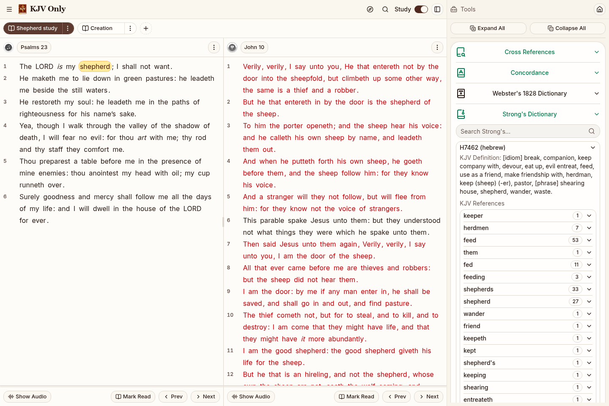
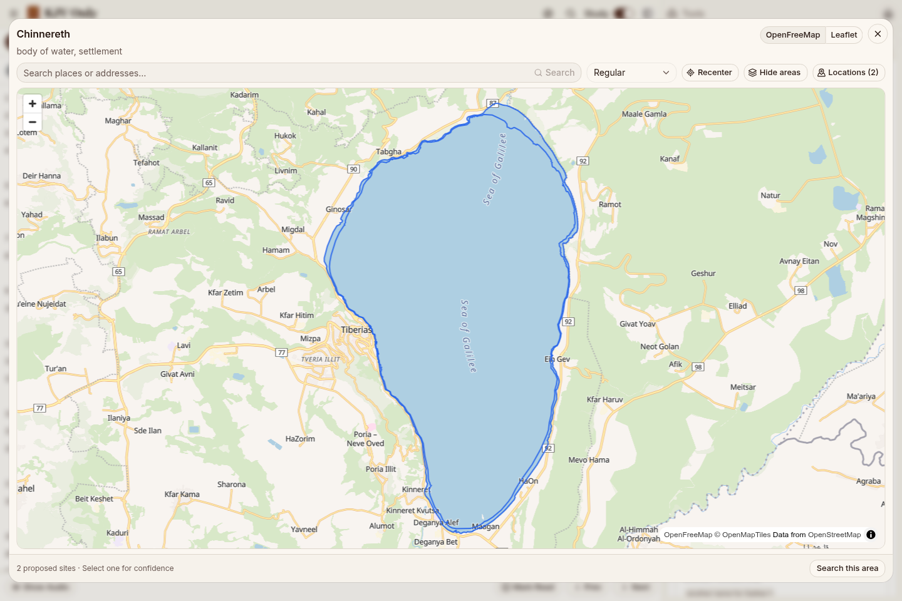

# KJV Only

KJV Only is an installable King James Bible reader for reading, listening, and study on desktop and mobile, with offline downloads and locally saved study material.

| Study workspace | Interactive maps |
| --- | --- |
| [](assets/screenshots/study-workspace.png) | [](assets/screenshots/map-dialog.png) |

## Features

- Flexible workspace with tabs, split panels, and a study sidebar
- Quick passage navigation and multiple search modes, including typo-tolerant Smart Search
- Word study with Strong's, concordance, cross references, dictionaries, and topics
- Interactive maps, family trees, and biblical and historical timelines linked to passages
- Rich-text notes and bookmarks organized with folders and tags, plus import/export
- Chapter audio, reading progress, and customizable themes and reading layouts
- Offline downloads for reading and study, with installable PWA support

## Tech Stack

- React 19, TypeScript 6, and Vite 8
- Tailwind CSS 4 and shadcn/ui with Base UI
- Lexical for rich-text editing
- MapLibre GL and Leaflet / React Leaflet for maps
- vis-timeline and vis-data for timelines
- Vitest, Playwright, and axe-core for testing; ESLint for linting

## Development

Use Node.js 22 (the version pinned in [`.nvmrc`](.nvmrc)) and npm 10.

```bash
npm ci
npm run dev
```

Bible data is included in the repository for normal development. Data regeneration commands are listed in [`package.json`](package.json); some require Python 3.

Build and preview:

```bash
npm run build
npm run preview
```

## Checks

```bash
npm run audit
npm run check:deps
npm run lint
npm run typecheck
npm run test:coverage
npm run build
npx playwright install --with-deps chromium
npm run test:e2e:release
```

See [`SECURITY.md`](SECURITY.md) for reporting security issues.
