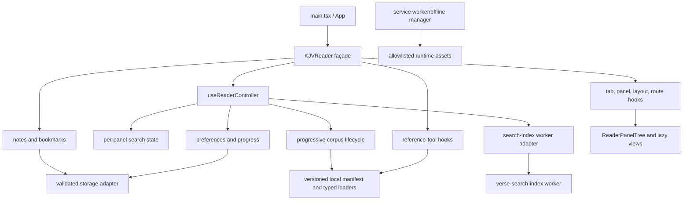

# Architecture and State Ownership

KJV Only is a client-only React application. `src/main.tsx` owns bootstrap and service-worker registration. `KJVReader` is the current application façade, while hooks own individual reader domains and `ReaderPanelTree` composes the recursive workspace.

## Ownership rules

- Components render state and emit user intent; domain validation belongs in hooks or `src/lib`.
- `KJVReader` may coordinate domains but must not add new direct localStorage, parser, or feature-algorithm logic.
- Reader-wide corpus, preferences, progress, search-index, and per-panel search-state ownership enters through `useReaderController`.
- The Genesis 1 bootstrap is an initial-read optimization only. The full 66-book corpus is canonical, replaces the bootstrap atomically, and gates shared-layout application and search indexing.
- Layout changes go through the workspace helpers so tab/panel/history/share-link invariants stay atomic.
- Notes and bookmarks enter the application only through the bounded transfer/storage validators.
- Runtime data loaders own same-origin paths, validation, promise caching, and recovery errors.
- Service-worker/cache names come from `public/app-cache-config.js`; cleanup may touch only names with the application prefix.
- Security-relevant link navigation goes through `src/lib/url-policy.ts` and the editor URL adapter.

## Compatibility contract

Persisted key names, import/export versions, canonical Bible addresses, share-layout syntax, and public runtime URLs are compatibility surfaces. `/data/kjv.json` remains the canonical full-corpus URL. Refactors must retain these surfaces or provide a tested migration/adapter. State replacement happens only after complete validation; corrupt optional records are ignored without discarding valid records.

The durable Graphify artifacts in `graphify-out/` document the dependency graph. Rebuild and review them after major ownership moves, and treat inferred edges as hypotheses to confirm in source.
