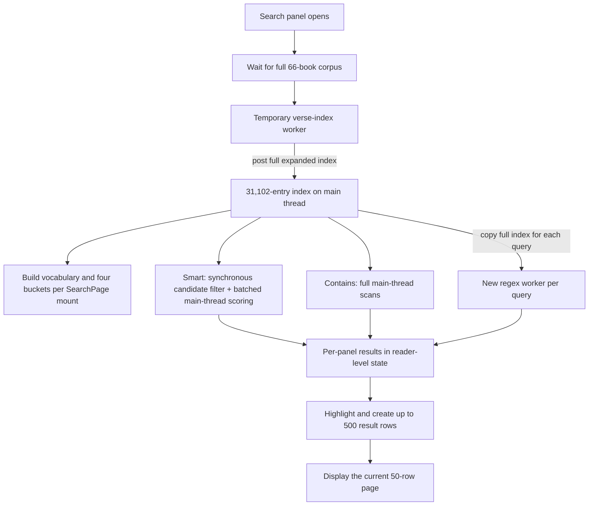

# Dependency PR Safety, Search Performance, and Next Work Assessment

**Date:** 2026-08-25

**Repository baseline:** `c221c30` on `main`

**Scope:** The five open dependency pull requests, current CI/release health, Search-page performance, remaining structural work, and possible product features.

## Executive decision

None of the five open pull requests should be merged unchanged today.

- [PR #3 — Sonner 2.0.8](https://github.com/gcoxdev/KJV-Only/pull/3) is the only low-risk upgrade. Its verification job passed, and it passed an additional current-source typecheck, lint, and unit-test pass in an isolated worktree. It is still 11 commits behind `main`, so it should be rebased and run through the current 20-journey release suite before merge.
- [PR #4 — Bible Passage Reference Parser 4.0.0](https://github.com/gcoxdev/KJV-Only/pull/4) is safe only after a one-line compatibility migration. The PR currently fails typecheck. Changing `book_alone_strategy` from the obsolete `"include"` value to `"first_chapter"` preserves this application's existing book-only behavior; that change passed typecheck and all 11 reference-command tests in an isolated v4 verification.
- [PR #2 — `@lexical/list` 0.49.0](https://github.com/gcoxdev/KJV-Only/pull/2) and [PR #5 — `@lexical/react` 0.49.0](https://github.com/gcoxdev/KJV-Only/pull/5) are unsafe independently. Each creates two incompatible Lexical type/runtime families in the same editor. They should be superseded by one coordinated upgrade of `lexical` and every `@lexical/*` package.
- [PR #1 — grouped development tooling](https://github.com/gcoxdev/KJV-Only/pull/1) is not installable as proposed. TypeScript 7.0.2 conflicts with `typescript-eslint` 8.67.0's supported TypeScript range. Vite 8 and ESLint 10 are also major migrations and should not share one failure domain with TypeScript, Node types, shadcn, and several plugins.

Two repository/release issues should be addressed before dependency merges:

1. Every PR's dependency-review check is failing because GitHub's Dependency Graph is disabled, so the repository currently has no working PR dependency-vulnerability gate.
2. The current CI SBOM command fails against the lockfile-only graph because Tailwind's optional WASM packages refer to packages not represented as installed. `npm sbom --sbom-format cyclonedx` succeeds against the installed tree; the workflow's `--package-lock-only` form does not.

The reported Search-page delay is real and reproducible. In one local production-preview diagnostic with 4× CPU throttling, a Smart search for `love` took 5.22 seconds to show its first result and produced a 3.89-second main-thread long task. Regex search took 1.32 seconds to show its first result and produced a 1.17-second long task. Static inspection explains both results: the full expanded index crosses worker boundaries repeatedly, Smart candidate filtering and scoring remain mostly on the UI thread, and all 500 results are highlighted/rendered before the code slices the visible page to 50.

My recommended next sequence is:

1. Repair CI evidence: SBOM generation, Dependency Graph, and aging GitHub Actions.
2. Replace/rebase the Sonner and parser PRs and verify them together locally, while preserving separate commits and doing one approved push.
3. Implement the Search quick wins and persistent search-worker architecture with golden-result tests.
4. Split the toolchain upgrade into compatible, reviewable units.
5. Perform one coordinated Lexical migration, including serialized-note compatibility and editor security tests.
6. Create headroom within the existing local-asset deployment; do not introduce S3 or a CDN.
7. Build new search and study features on the hardened search service.

No dependency, application functionality, GitHub setting, commit, push, or deployment was changed during this assessment.

## Implementation update

The dependency work recommended above was subsequently implemented locally as a curated replacement for the five PR branches. The remote PRs remain open until the replacement commit is pushed and they can be closed without losing review context.

- Sonner is now 2.0.8, and the Bible reference parser is 4.0.0 with the behavior-preserving `first_chapter` migration.
- `lexical` and all eight direct `@lexical/*` packages are pinned together at 0.49.0. Lexical 0.49's required `yjs` peer is explicit, and CI now checks the aligned tree.
- The compatible toolchain is ESLint 10.9.1, TypeScript 6.0.3, `typescript-eslint` 8.68.0, Vite 8.2.2, React plugin 6.1.0, shadcn 4.19.0, and Node 22 type declarations. TypeScript 7 remains intentionally deferred because the typed ESLint parser supports TypeScript only below 6.1.
- The supported runtime is pinned to Node 22.23.2 with npm 10.9.4. TypeScript's deprecated `baseUrl` setting was removed without changing alias resolution, and the Vite/Vitest configs now use `import.meta.dirname`.
- CI's SBOM command now uses the installed tree, GitHub Actions are pinned to reviewed immutable release SHAs, and monthly GitHub Actions updates were added to Dependabot. Enabling GitHub's Dependency Graph remains an owner-controlled repository setting.

Verification on the replacement set passed a clean install using the pinned Node/npm line, a zero-vulnerability high-severity audit, dependency-tree validation, ESLint, TypeScript, 259 coverage tests across 45 files, the 1.1 GB production build and distribution guard, CycloneDX SBOM generation, and all 20 production-preview browser journeys. Those journeys include Search, serialized note editing/import/export, reference commands, offline install/reload, accessibility, mobile study tools, and service-worker upgrades.

## Assessment method and evidence

This assessment used:

- live GitHub PR metadata and current check results;
- dependency manifest/lockfile diffs against `main`;
- official release and migration documentation;
- current repository usage and compatibility-surface inspection;
- isolated installs and focused verification for the Sonner and parser upgrades;
- the existing RC, hardening, architecture, release, and KJVReader-refactor records;
- Graphify's persistent repository graph plus a focused Search traversal;
- source-level hot-path analysis; and
- two local headless-Chromium production-preview diagnostics, including a 4× CPU-throttled pass.

The current baseline still reports zero known vulnerabilities from `npm audit --audit-level=high`. That is useful evidence, but it does not replace the currently disabled dependency-review check or review of breaking major releases.

## Open dependency PR assessment

### Decision table

| PR | Proposed change | Current checks | Risk | Decision |
| --- | --- | --- | --- | --- |
| [#3](https://github.com/gcoxdev/KJV-Only/pull/3) | Sonner `2.0.7` → `2.0.8` | Verify passes; dependency review fails from repository configuration | Low | Conditionally safe after rebase and the current full gate |
| [#4](https://github.com/gcoxdev/KJV-Only/pull/4) | Bible reference parser `3.2.0` → `4.0.0` | Typecheck fails at the removed option value | Medium-low after migration | Do not merge as-is; replace or amend with `first_chapter` and regression tests |
| [#2](https://github.com/gcoxdev/KJV-Only/pull/2) | `@lexical/list` `0.41.0` → `0.49.0` | Typecheck fails across list/editor nodes | High as proposed | Close/supersede; upgrade the complete Lexical family together |
| [#5](https://github.com/gcoxdev/KJV-Only/pull/5) | `@lexical/react` `0.41.0` → `0.49.0` | Typecheck fails across editor states, nodes, and plugins | High as proposed | Close/supersede; upgrade the complete Lexical family together |
| [#1](https://github.com/gcoxdev/KJV-Only/pull/1) | 11 development-tool upgrades | `npm ci` fails before tests can start | High as proposed | Close/supersede with several compatible upgrade units |

PRs #2–#5 target the older `987d1be` baseline and are 11 commits behind current `main`. Their previous results do not cover the completed reader refactor, study-data optimization, or current 20-journey release suite.

### PR #3 — Sonner 2.0.8

**Verdict: low risk and likely safe after rebase.**

Repository usage is narrow: the shared Toaster wrapper, reader storage-warning hook, and KJVReader toast calls. The [2.0.8 release](https://github.com/emilkowalski/sonner/releases/tag/v2.0.8) contains accessibility-label support and fixes for modal layering, event-listener removal, custom-toast dismissal, Safari styling, and other reported defects. There is no advertised breaking API change.

Evidence:

- GitHub's full verify job passed on the PR's older baseline, including install, audit, lint, typecheck, coverage, build, browser tests, and SBOM.
- Against current source in an isolated worktree, Sonner 2.0.8 passed TypeScript, ESLint over `src`, and 229 source unit tests across 43 test files.
- The current React 19 usage is within Sonner's declared peer support.

Required merge gate:

1. Rebase or regenerate the PR from current `main`.
2. Run the complete release sequence in [`../docs/release.md`](../docs/release.md), particularly production build and all 20 production-preview journeys.
3. Confirm storage-warning and general toast display/dismissal at desktop and mobile widths.

### PR #4 — Bible Passage Reference Parser 4.0.0

**Verdict: not safe as-is; safe with a small explicit migration and tests.**

The PR fails because [`../src/lib/reference-command.ts`](../src/lib/reference-command.ts#L128) supplies `book_alone_strategy: "include"`, while v4 accepts only `"ignore"`, `"full"`, or `"first_chapter"`. The upstream [v3-to-v4 guide and option documentation](https://github.com/openbibleinfo/Bible-Passage-Reference-Parser) confirms those choices and notes a minimum Node 17/early-2022 browser environment due to `structuredClone`; this project's Node 22 build and modern-browser PWA target satisfy that runtime requirement.

The intended behavior is already pinned by a repository test: a book-only input such as `John` opens John 1. Therefore, `"first_chapter"` is the correct replacement. `"full"` would encode a different upstream meaning even though this app currently normalizes some book entities itself.

Isolated v4 evidence after applying only that migration:

- TypeScript project build: passed.
- Reference-command suite: 11/11 passed, including book-only, mixed book-only/chapter, ranges, abbreviations, and compact references.

Required merge gate:

1. Replace `"include"` with `"first_chapter"`.
2. Retain the existing book-only and mixed-reference tests; add an explicit ambiguous-prefix/no-match case if the PR is rebuilt.
3. Run the current full unit, build, and browser gates after rebasing.

### PRs #2 and #5 — partial Lexical 0.49 upgrades

**Verdict: unsafe independently; a coordinated upgrade is worth doing.**

The application currently holds `lexical` plus eight `@lexical/*` packages at the 0.41 line. PR #2 upgrades only the list package and PR #5 only the React package. Their lockfiles then install nested Lexical versions. Types that are structurally similar but come from separate package instances are incompatible, which is exactly what the CI errors show across node registration, toolbar commands, editor state, custom links, and list indentation.

The target is not a routine patch. [Lexical 0.49](https://github.com/facebook/lexical/releases/tag/v0.49.0) includes breaking changes around the `$config()` protocol and invariant command payloads. The intervening [0.48 release](https://github.com/facebook/lexical/releases/tag/v0.48.0) also contains worthwhile security hardening: `LinkNode.sanitizeUrl()` fails closed for unparseable URLs to prevent a potential XSS path. That makes a coordinated migration desirable, but not safe to approximate by merging the two Dependabot PRs.

Recommended replacement:

- Upgrade `lexical`, `@lexical/code`, `link`, `list`, `react`, `rich-text`, `selection`, `table`, and `utils` to one identical release in one branch.
- Use exact aligned versions, or otherwise enforce one resolved Lexical family. Do not allow nested mixed copies.
- Review every custom node, especially `KjvInternalLinkNode`, and every direct command/node type import against the 0.49 migration notes.
- Verify loading, editing, and re-saving notes serialized by 0.41 without data loss or silent format drift.
- Test headings, lists, links, tables, colors, history/undo, paste, internal KJV links, external URL sanitization, import/export, disabled/read-only behavior, and mobile toolbar interactions.
- Add an install assertion such as `npm ls lexical @lexical/react @lexical/list` so mixed instances fail before typecheck.

This should be a dedicated release batch rather than combined with Vite or TypeScript changes.

### PR #1 — grouped development tooling

**Verdict: unsafe and not installable as proposed.**

The isolated `npm ci` failure is deterministic: TypeScript 7.0.2 does not satisfy `typescript-eslint@8.67.0`, whose official supported range is [`>=4.8.4 <6.1.0`](https://typescript-eslint.io/users/dependency-versions/). Tests and builds never start.

The group also combines unrelated major migrations:

- ESLint 9 → 10 and `@eslint/js` 9 → 10;
- Vite 7 → 8 and React plugin 5 → 6;
- TypeScript 5.9 → 7;
- Node type declarations 24 → 26 even though the verified build runtime is Node 22;
- shadcn CLI 3 → 4; and
- several lint/plugin/global packages.

These changes should be split as follows:

| Replacement unit | Recommendation | Why |
| --- | --- | --- |
| ESLint 10 + `@eslint/js` 10 + compatible lint plugins/globals | Upgrade together and fix/configure new recommended rules | ESLint 9 reached end of support on 2026-08-06; the [v10 migration guide](https://eslint.org/docs/latest/use/migrate-to-10.0.0) documents Node and rule/config changes, and the [support table](https://eslint.org/version-support/) marks v10 current |
| Vite 8 + React plugin 6 | Dedicated build-system branch | [Vite 8](https://vite.dev/blog/announcing-vite8) replaces the esbuild/Rollup pipeline with Rolldown; the custom runtime-asset copier, worker chunks, service worker, manifest generation, and 1.1 GB distribution all require full output comparison |
| `typescript-eslint` 8.67 | May upgrade with current TypeScript first | It supports ESLint 10 but not TypeScript 7 |
| TypeScript | Evaluate 6.x separately; defer 7 until the lint stack supports it | TypeScript 6 is explicitly the transition release for 7 and documents removed/deprecated options in its [release notes](https://www.typescriptlang.org/docs/handbook/release-notes/typescript-6-0.html) |
| `@types/node` | Align with the actual Node 22 runtime, not 26 | Types should not make unavailable Node 24/26 APIs appear valid in build scripts |
| shadcn CLI 4 | Update independently | It is authoring tooling, not an application runtime dependency |

For Vite 8, compare generated worker names, `app-shell-assets.json`, service-worker startup assets, runtime allowlist output, total bytes/files, entry JS/CSS, production offline reload, and Amplify preview behavior. Passing `vite build` alone is not sufficient for this repository.

## CI and dependency-governance findings

### Dependency review is not functioning

All five PRs have a failed dependency-review job with the same repository-setting error. GitHub documents that [dependency review becomes available when the Dependency Graph is enabled](https://docs.github.com/en/code-security/concepts/supply-chain-security/dependency-review). Until the owner enables it, the workflow cannot provide the security evidence its name implies.

Recommended action:

1. Enable Dependency Graph in repository security settings.
2. Rerun the PR checks and require dependency review for dependency changes.
3. Keep `fail-on-severity: high`; optionally add license policy only after defining an explicit allow/deny policy.

### The CI SBOM command is currently broken

The workflow uses:

```text
npm sbom --package-lock-only --sbom-format cyclonedx
```

On the current lockfile, npm reports five missing dependencies beneath Tailwind's optional `@tailwindcss/oxide-wasm32-wasi` package. Generating from the installed tree without `--package-lock-only` succeeds.

Recommended behavior-preserving fix:

- Generate the SBOM after `npm ci` from the installed dependency tree.
- Validate that the output is non-empty JSON and upload it even if a later browser test fails.
- Add an explicit CI test for the SBOM step so future lockfile shape changes fail with a focused message.

### GitHub Actions are behind the current runtime line

Current checks warn that `actions/checkout@v4`, `actions/setup-node@v4`, `actions/upload-artifact@v4`, and `actions/dependency-review-action@v4` target deprecated Node 20 and are being forced onto Node 24. Current upstream majors are available in the [checkout](https://github.com/actions/checkout/releases), [setup-node](https://github.com/actions/setup-node/releases), [upload-artifact](https://github.com/actions/upload-artifact/releases), and [dependency-review-action](https://github.com/actions/dependency-review-action/releases) release streams.

Recommended action:

- Add a monthly `github-actions` entry to Dependabot instead of covering only npm.
- Upgrade each action deliberately, reviewing its major-version notes and minimum runner requirement.
- Pin third-party actions to immutable full commit SHAs, with a version comment for maintainability.
- Keep job permissions minimal; the current read-only default is a good baseline.

### Runtime-version alignment

The RC passed on Node 22.22.1, and CI selects Node 22, but the repository has no `.nvmrc`, `.node-version`, package `engines`, or repository-controlled Amplify build file. That leaves local, CI, and Amplify selection easier to drift apart.

Repository-side pinning would make builds more reproducible, but Amplify settings and deployed-header verification remain owner-controlled/deferred work. Any repository Amplify configuration should be introduced only after comparing it with the active console configuration; it should not be guessed or pushed solely to remove a warning.

## Search-page performance assessment

### Current architecture mapped with Graphify

Graphify places `search-page.tsx`, `search.ts`, `verse-search-index.ts`, `regex-search.ts`, and `SearchPage()` in the same central search community. The focused traversal also links Search to KJVReader, reader types, panel routing, the corpus hook, the verse-index hook, and performance instrumentation. Source inspection confirms the worker edges that static graph extraction does not express as ordinary function calls.



Good foundations already present:

- Search is lazy-loaded rather than included in the startup entry chunk.
- Full-corpus parsing and initial verse-index construction have worker paths.
- Regex execution is isolated from the main thread.
- Search runs have cancellation IDs, a 500-result cap, and 50-result pagination.
- Input drafts use deferred values, and Smart scoring yields between batches.
- The normal reading screen does not build the search index until Search is requested.

The problem is that these boundaries stop one step too early: the expanded index is moved back to React, and most subsequent work happens on or repeatedly crosses the main thread.

### Diagnostic measurements

These are single local production-preview diagnostics, not universal end-user benchmarks. Chromium's service worker was blocked so cached prior assets could not hide the cold data/index path.

| Measurement | Normal CPU | 4× CPU throttling |
| --- | ---: | ---: |
| Initial reader ready | 2.80 s | 5.58 s |
| Search click → enabled controls | 4.62 s | 6.29 s |
| Search-index performance measure | 3.41 s | 5.39 s |
| Smart `love` → complete 500-result set | 1.22 s | 5.27 s |
| Smart `love` → first visible result | Not separately sampled | 5.22 s |
| Long tasks during throttled Smart query | — | 5 tasks, 4.94 s total, 3.89 s maximum |
| Regex `love` → first visible result | — | 1.32 s |
| Regex `love` → complete result set | — | 1.93 s |
| Long tasks during throttled Regex query | — | 2 tasks, 1.24 s total, 1.17 s maximum |

The 4× results match the reported experience: yielding between Smart scoring batches does not prevent the synchronous candidate-building work or result render from blocking interaction.

### Confirmed bottlenecks

1. **Large worker round trips and duplicated index representation.** [`use-verse-search-index.ts`](../src/hooks/use-verse-search-index.ts#L82) posts the full nested corpus to a worker, which builds the index and posts the full expanded index back. Each entry duplicates display text, lowercased text, original/lowercased word arrays, and phonetic arrays in [`verse-search-index.ts`](../src/lib/verse-search-index.ts#L93). This increases clone time, heap use, and garbage collection.
2. **Vocabulary construction is repeated per mounted Search page.** [`search-page.tsx`](../src/components/reader/search-page.tsx#L277) walks every indexed verse and word to build a Set and four bucket Maps. Multiple Search panels repeat the same application-wide work.
3. **Smart candidate filtering is synchronous.** The full index is filtered on the UI thread before batched scoring begins at [`search-page.tsx`](../src/components/reader/search-page.tsx#L614). `isSmartSearchCandidate` itself performs token/phonetic/similarity work. This is a likely source of the observed 3.89-second throttled long task.
4. **Smart partial publishing repeatedly sorts accumulated results.** Each publish clones and sorts the scored array at [`search-page.tsx`](../src/components/reader/search-page.tsx#L630), then sends a new results array through reader-level per-panel state.
5. **Contains searches scan all verses and allocate a Set per candidate.** [`matchSelectedWords`](../src/lib/verse-search-index.ts#L122) normalizes needles and constructs a per-entry Set for each match attempt.
6. **Regex recreates a worker and clones the entire index per query.** [`search-page.tsx`](../src/components/reader/search-page.tsx#L707) sends all entries into a fresh worker. The regex itself is isolated, but serialization and final rendering still block.
7. **The result page is sliced after rendering.** [`search-page.tsx`](../src/components/reader/search-page.tsx#L899) highlights and creates React elements for every result—up to 500—then slices those elements to the visible 50. The app pays approximately ten pages of render/highlight work to display one.
8. **Progress and partial results have a wide render blast radius.** Per-panel results live in reader-owned state, which clones the leaf-state record on every patch. The panel tree also creates an inline Search-state callback, preventing a stable memo boundary.
9. **The existing browser budget measures index construction only.** [`e2e/app.spec.ts`](../e2e/app.spec.ts#L77) verifies a sub-15-second index build and one result, but it does not measure click-to-ready, query-to-first-result, query completion, long tasks, repeated queries, memory, cancellation, or multiple Search panels.

### Behavior-preserving Search plan

#### Phase S0 — characterize and measure before moving code

- Add golden result/order fixtures for Smart, Contains Any, Contains All, and Regex across case sensitivity, punctuation, book scopes, exact phrases, misspellings, empty/invalid input, the 500-result cap, and ties.
- Pin cancellation, Stop, multi-panel isolation, current-page preservation, and result-open behavior.
- Add performance marks for Search click-to-ready, query-to-first-page, query-to-complete, worker transfer, and result render.
- Capture heap/index estimates where supported and a long-task count in the throttled production browser journey.
- Use measured baselines to set regression ceilings, then ratchet them after optimization. A key target should be no individual Search main-thread task over 50 ms on the existing 4× diagnostic profile.

#### Phase S1 — low-risk UI and computation fixes

1. Slice the raw `results` array to the active page before highlighting or creating JSX. This preserves result content, ordering, page size, and navigation while removing known wasted work.
2. Extract a memoized `SearchResultRow` so progress and control changes do not rebuild unchanged highlights.
3. Cache tokenized highlight inputs or return highlight terms with the worker result; do not split and normalize each result text repeatedly during render.
4. Throttle progress publication to an animation frame or approximately 100–200 ms, and mark result/progress commits as React transitions so input and Stop remain urgent.
5. Stabilize the per-leaf `onStateChange` callback at the panel adapter boundary.
6. Apply `content-visibility: auto` with a realistic intrinsic row size as a second layer of protection for long visible lists.
7. Preload the Search chunk on hover/focus of an Open Search control. If the full corpus is already ready, optionally begin index preparation on that same explicit user intent; do not restore unconditional startup indexing.

#### Phase S2 — one persistent search service

Create one application-level dedicated Worker instance, owned by the reader search controller, that retains the compact index and serves every Search panel. This is a normal dedicated worker shared by application code, not a browser `SharedWorker`, so browser compatibility remains close to the current implementation.

The worker protocol should:

- receive the corpus once and keep its index/vocabulary off the main thread;
- accept small query messages containing run ID, mode, input, case flag, book scope, result cap, and page request;
- execute Smart candidate selection/scoring, Contains, and Regex in the worker;
- cancel or disregard stale run IDs;
- stream first-page results/progress and finish with the same deterministic ordering and 500-result cap;
- return only display fields needed by the requested page plus total/capped count; and
- expose a compatibility fallback using the same pure engine for browsers without workers.

Internal engine improvements that can preserve exact output:

- Build an inverted normalized-word → verse-ID index for Contains queries and Smart candidate narrowing.
- Build prefix and phonetic vocabulary buckets once, not per component.
- Normalize selected needles once per query and avoid per-verse Set allocation.
- Maintain the best 500 Smart results with a fixed-size top-K structure using the current score and canonical-index tie-break, instead of repeatedly sorting the full accumulated score list.
- Use integer IDs plus shared string/token tables—or similarly compact structures—to avoid repeated text/array copies.
- Add a bounded LRU for identical mode/query/case/scope requests.

#### Phase S3 — component boundary cleanup

The 1,616-line Search page currently owns controls, book-tree filtering, vocabulary preparation, three execution strategies, worker lifecycle, progress, pagination, highlighting, and results. Refactor along responsibility boundaries while the S0 fixtures guard behavior:

```text
SearchPage                 UI composition only
├── SearchControls         mode, query, case, and scope intent
├── SearchBookFilter       book/testament grouping
├── SearchResults          paging and status
└── SearchResultRow        memoized highlight and navigation

useSearchController        per-panel UI/run state and commands
search-worker-client       one worker, request IDs, fallback, lifecycle
search-engine              pure deterministic modes and ranking
verse-search.worker        retained index, vocabulary, query execution
```

Do not change query semantics, ranking, case behavior, result cap, pagination, or open-target behavior as part of the performance refactor. New search capabilities should follow only after before/after fixtures and performance evidence pass.

## Prioritized next-work roadmap

### P0 — restore trustworthy release evidence

| Work | Outcome | Effort | Notes |
| --- | --- | ---: | --- |
| Fix installed-tree SBOM generation | CI completes and emits a usable CycloneDX artifact | Small | Repository change; batch with the next approved maintenance push |
| Enable GitHub Dependency Graph | Dependency-review jobs become meaningful | Small | Owner setting; no application rebuild by itself |
| Update/pin GitHub Actions and add Actions Dependabot | Removes forced-runtime warnings and improves supply-chain maintenance | Small-medium | Review each major and runner requirement |
| Document/pin the supported Node line | Local, CI, and Amplify builds stop drifting | Small | Coordinate repository files with actual Amplify configuration |

### P1 — user-visible Search performance

Implement S0 and S1 first, then S2. This is the largest currently observed user-facing performance opportunity that does not require changing public data URLs or moving assets. Keep Search feature additions out of the initial optimization branch.

Completion evidence should include identical golden results/order, current Search workflows, Stop/cancellation, multi-panel isolation, normal and 4× timings, long-task evidence, full release E2E, and offline Search after the Core package is downloaded.

### P1 — dependency maintenance in safe batches

1. Rebase Sonner 2.0.8 and the parser 4 migration.
2. Move ESLint to its supported v10 line in a dedicated tooling commit.
3. Upgrade Vite/Rolldown separately with complete artifact/offline parity checks.
4. Keep TypeScript at a version supported by `typescript-eslint`; evaluate 6.x before 7.x.
5. Perform the coordinated Lexical migration as a separate application-risk batch.

Separate local commits can preserve review and rollback boundaries while a single later approved push avoids unnecessary Amplify rebuilds. Lexical and Vite should still be separate deployment candidates because each can affect persisted content or production output broadly.

### P1 — recover local deployment headroom

The last RC distribution was 1,146,116,746 bytes against a 1,150,000,000-byte ceiling: only 3,883,254 bytes remain. It was also at 6,751 of 7,000 files. Source `public/` is approximately 1.4 GB, led by roughly 736 MB of audio and 320 MB of maps; the ignored `public/delete/` directory is not deployed.

The owner has chosen to keep assets local, so the next step is not S3/CDN migration. Instead:

- inventory duplicate and unreachable runtime assets against the generated manifests;
- test lossless image/GeoJSON compaction and compatible audio re-encoding where quality and URLs can be preserved;
- keep generator sources and quarantine data excluded from `dist`;
- add per-package byte/file budgets so maps or audio cannot consume all remaining headroom silently; and
- require a deliberate budget decision before adding any new large dataset.

No Git-history rewrite, LFS migration, external host, or URL change is recommended in this workstream.

### P2 — targeted structure, design, and test improvements

- **Search boundaries:** carry out S3 as part of Search optimization, not as a cosmetic rewrite.
- **Reader composition:** `KJVReader` is now 2,245 lines and within the completed refactor's target range. Do not resume line-count-driven extraction. Extract only when a new change reveals a cohesive invariant owner.
- **Panel composition:** `ReaderPanelTree` remains 2,058 lines. The next useful extractions are stable feature adapters/callbacks and the cohesive audio controller, but only when protected by relevant browser tests.
- **Dead scaffolding:** `component-example.tsx` and its example wrapper have no inbound application imports. Confirm they are not intentional design references, then remove them in a maintenance cleanup.
- **Coverage:** current global thresholds remain close to actual branch coverage. Add characterization around new controller/worker protocols before raising thresholds in small increments; do not lower or broadly exclude production code.
- **Performance regression tests:** add Search query/long-task budgets alongside the current startup, corpus, and index budgets.
- **Accessibility:** add keyboard traversal and screen-reader status tests for Search results, progress, cancellation, filters, and result counts. Preserve the RC's forced-colors, reduced-motion, zoom, and narrow-viewport matrix.
- **Data provenance:** expose the version/source/coverage metadata already produced by reference-data generators so users and maintainers can distinguish authoritative KJV text from optional study resources.

### Owner-controlled/deferred release work

The prior assessment intentionally deferred Amplify-side headers/build settings. Before a formal public release, the owner should still verify the deployed response headers, SPA routing, Node/build configuration, cache headers, and a real offline reload on the deployed origin. This remains separate from repository-local work and should not be changed by assumption.

## Feature opportunities

These are optional product changes, not part of the behavior-preserving hardening scope. They should receive a short product/design pass before implementation.

### Best near-term candidates

| Feature | User value | Why it fits | Effort/risk |
| --- | --- | --- | --- |
| Saved searches and recent-search history | Reuse complex Smart/Regex/book-scope queries | Natural first consumer of the new search service; can remain local-first | Medium; needs versioned validation and clear-history controls |
| Search facets and result tools | Counts by book/testament, canonical vs relevance sort, surrounding-verse context, copy/export | Makes the existing 500-result workflow more useful | Medium; compute facets in worker and preserve default ranking |
| Shareable search state | Reopen mode/query/scope in a tab or layout link | Extends the existing shareable workspace model | Medium; never embed personal history or results in URLs |
| Custom reading plans | Canonical, chronological, date-based, and user-selected plans | Current progress tracks only whole-Bible chapter completion | Medium-high; requires a versioned plan schema and migration from existing progress |
| Note/bookmark collections and tags | Organize sermon studies, topics, and recurring verse groups | Builds on strong local-first notes/bookmarks | Medium-high; import/export and conflict behavior must be explicit |
| Study packet print/export | Combine selected KJV passages, citations, notes, and bookmarks | High value for offline teaching/study without a backend | Medium; add print accessibility and deterministic formatting tests |

### Useful follow-on candidates

- **PWA update notification and recovery panel:** show when a new shell is waiting, explain which cache version is active, and offer a safe reload/export-first recovery path.
- **Audio sleep timer and resume position:** playback speed and continuous chapter playback already exist; a timer and per-chapter resume point would complete the listening workflow without duplicating current features.
- **Cross-reference graph view:** visualize paths among the existing cross-reference dataset and open nodes in current/new panels. Cap traversal depth and render progressively.
- **Study workspace templates:** save a reusable arrangement of Bible, Search, notes, maps, and tools without embedding private note content in a shared URL.
- **Reference-resource provenance view:** surface source, generator version, coverage, and update date for Strong's, dictionaries, maps, genealogy, topics, and cross references.
- **Optional encrypted backup/sync:** potentially valuable across devices, but high risk and not a near-term default. It requires authentication, encryption/key recovery, privacy policy, conflict resolution, abuse controls, threat modeling, and a paid operational backend. Preserve local-only use even if this is added later.

### Feature guardrails

- Keep the KJV text and KJV-only product identity central; do not turn the reader into a general translation-comparison platform by accident.
- Keep new personal data local-first unless the user explicitly opts into a separately designed sync service.
- Validate and version every new persisted/exported shape before writing it.
- Confirm licensing, attribution, provenance, and artifact size before adding reference datasets.
- Do not spend the remaining distribution budget without creating equivalent headroom.
- Add features only after the release gates for the underlying boundary are trustworthy.

## Recommended delivery sequence

```text
Release evidence repair
  → Sonner + parser compatibility batch
  → Search characterization and quick wins
  → Persistent search service
  → ESLint/tooling units and Vite migration
  → Coordinated Lexical migration
  → Local asset headroom
  → Saved searches/facets
  → Reading plans or note/bookmark organization
```

For each stage:

1. Preserve a focused characterization fixture before moving ownership or changing a dependency.
2. Run clean install, audit, lint, typecheck, coverage, build/distribution checks, development E2E, and production-preview E2E.
3. Compare public URLs, saved-data shapes, search output/order, offline package contents, and artifact budgets.
4. Keep commits reviewable locally.
5. Request explicit approval before committing and request approval again before pushing; consolidate pushes where practical because `main` pushes trigger Amplify rebuilds.

## Final assessment

The project's prior hardening and KJVReader refactor are in good shape; the next work should not be another broad rewrite. The immediate risks are now concentrated and actionable: broken CI evidence, unsafe dependency grouping, a coordinated-but-worthwhile Lexical migration, very narrow distribution headroom, and Search work that remains on the main thread despite the initial worker boundary.

Search should be the next substantive application change after the small CI/dependency hygiene batch. It has measurable multi-second latency on a constrained CPU, clear source-level causes, and a path to improvement that can retain the exact current search semantics. Once the persistent search service exists, saved searches, facets, context, and shareable search state become much safer and cheaper product additions.
