# KJVReader Refactor and Study-Mode Performance Plan

**Assessment date:** 2026-08-24
**Committed baseline:** `cb46f04` (`refactor(reader): harden corpus lifecycle`)
**Scope:** Reduce `KJVReader` orchestration risk and improve study-word responsiveness without changing product behavior.
**Status:** Phase 1 is committed as `8879054`; Phase 2 is committed as `ee6689b`; Phase 4 is committed as `975039c`; Phase 5 is implemented and verified locally but remains uncommitted. Phase 3 remains intentionally deferred. Nothing has been pushed.

## Executive result

`KJVReader` was 4,601 lines at the original committed baseline. Phase 1 moved the asynchronous word-study fan-out into `useWordStudyCoordinator`, removed duplicated work, and reduced the component to 4,259 lines. Phase 2 moved the remaining word-study matching algorithms into `word-study-selection.ts`, reducing `KJVReader` to 3,977 lines. Phase 4 moved panel preview, adjacency, split, move, group insertion, orientation, and close orchestration into `usePanelInteractionController`, reducing `KJVReader` to 3,578 lines. Phase 5 now moves tab/tool orchestration and pending reader scrolling into focused hooks while retaining the tested destination engine in `usePanelRouting`, reducing `KJVReader` to 2,949 lines. The composition root is 1,652 lines (35.9%) smaller than the baseline without changing its public behavior.

The cold-path delay was mainly CPU scheduling, not network transfer. In the initial local Chromium trace, all 13 study responses arrived in about 0.28 seconds, but the click was blocked for about 4.18 seconds and the aggregate loaders took about 5.29 seconds. Genealogy enrichment alone used about 2.30 seconds, and loading each payload caused several search tools to eagerly construct indexes that a word selection did not need.

After this slice, two fresh common-word runs produced:

| Measure | Before | Current local runs | Change |
|---|---:|---:|---:|
| Click returns to browser | ~4.18 s | ~0.40–0.69 s | Approximately 84–90% faster |
| First matching study tools selected | All tools waited for slowest loader | ~0.76–0.92 s | Progressive instead of aggregate |
| Common-word fan-out settled | ~5.29 s loader fan-out | ~1.39–2.35 s | Approximately 56–74% faster |
| Genealogy enrichment CPU | ~2.30 s | ~0.84 s isolated | Approximately 64% faster |
| Genealogy-name fan-out (`Adam`, warm corpus) | Not separately measured | ~2.16 s | Residual target for worker/build-time work |

These are development-machine diagnostics, not universal device guarantees. The browser regression suite now records the same named measures and enforces conservative ceilings.

## Graphify architecture map

Graphify was refreshed after Phase 5. The current graph contains **3,170 nodes, 6,401 edges, and 204 communities**. `KJVReader()` remains the principal composition node, but its degree has fallen from 58 after Phase 4 to 53. The new boundaries are individually visible: `useWorkspaceNavigation()` has degree 11, `usePanelRouting()` has degree 11, and `usePendingReaderScroll()` has degree 8. Graph traversal places workspace helpers and tests with the navigation hook, destination construction and targeting with panel routing, and queue/dequeue/calculation helpers with pending scrolling. The split therefore follows existing responsibility communities rather than merely relocating a contiguous block of code.

```mermaid
flowchart TD
    App[App / KJVReader] --> Controller[useReaderController]
    App --> Workspace[useWorkspaceNavigation]
    App --> Routing[usePanelRouting]
    App --> PendingScroll[usePendingReaderScroll]
    App --> History[Leaf history]
    App --> PanelController[Panel interaction controller]
    App --> StudyHooks[Study data/search hooks]
    App --> Navigation[useWordStudyNavigation]
    App --> Coordinator[useWordStudyCoordinator]
    App --> Selection[Pure word-study selection]

    Workspace --> LayoutCommands[Tab and leaf layout commands]
    Workspace --> StaticPages[Static page and tool tab creation]
    Routing --> Destination[Destination policy and targeted routing]
    Routing --> ReferenceCommands[Reference-command execution]
    PendingScroll --> ScrollQueue[Pending target queue/dequeue]
    PendingScroll --> Viewport[Panel viewport and verse geometry]

    Navigation --> CrossRefs[Cross-reference selection]
    Navigation --> Coordinator
    Navigation --> Selection
    Coordinator --> Selection

    Coordinator --> Concordance[Concordance]
    Coordinator --> Dictionaries[Webster / AI / Word-Book / Hitchcock / Old English]
    Coordinator --> Lexical[Strong's / phrases / units]
    Coordinator --> Contextual[Genealogy / maps]

    StudyHooks --> Data[reader-data loaders]
    Coordinator --> Data
    Selection --> References[Normalized reference indexes]
    Data --> Assets[Runtime reference assets]
    Data --> Corpus[KJV corpus]

    App --> ViewModels[Study, settings, progress and panel prop assembly]
    PanelController --> Layout[Pure reader-layout commands]
    PanelController --> Neighbors[Model and DOM neighbor geometry]
    PanelController --> LeafState[Panel-local state swaps]
    ViewModels --> PanelTree[ReaderPanelTree]
```

The graph confirms that extraction alone does not remove `KJVReader` centrality: the component still composes nearly every domain. The refactor therefore needs to continue by ownership slice, not by moving arbitrary line ranges.

## Study-word latency assessment

### Previous request path

1. A token click entered `useWordStudyNavigation`.
2. The navigation hook opened cross references.
3. `openWordInStudyTools` opened the same cross references a second time.
4. It requested concordance, dictionaries, Strong's, genealogy, maps, phrases, and units together.
5. Every tool selection and matching accordion waited on one `Promise.all`, so the fastest dictionaries were gated by the slowest corpus-dependent operation.
6. Concordance and genealogy scanned the full corpus on the main thread.
7. When payload states arrived, concordance, dictionaries, genealogy, maps, and Strong's eagerly built complete search indexes even though the user had selected one exact word.
8. No request generation protected final selection state, so a slower earlier click could overwrite a later click.

### Controls implemented in this slice

- Cross references have one owner per navigation path; the duplicate open/load sequence is removed.
- Cross-reference and word-study requests use monotonically increasing request identifiers, so stale asynchronous results cannot replace the latest selection.
- Matching tool selections and accordions update progressively as each payload becomes usable.
- Full text-search indexes are built only when a search term actually requires them.
- Genealogy corpus enrichment is one filtered corpus pass rather than a large all-token index followed by five additional corpus scans.
- A compact genealogy-name gate avoids full corpus enrichment for words that cannot match genealogy.
- Genealogy work starts after primary tools have had a rendering opportunity.
- Performance marks are unique and idempotent, so overlapping clicks can be measured safely.
- Chromium coverage verifies progressive study loading and visible Concordance/Webster results.

### Payload and CPU characteristics

The study fan-out covers about 18 MB of raw JSON across concordance, cross references, dictionaries, Strong's, genealogy, and maps. Module-level loader promises already prevent duplicate network fetches after the first request. The remaining performance work is therefore mainly about parsing, matching, main-thread CPU, and when React is asked to build derived indexes.

Concordance and genealogy still depend on the complete corpus for runtime enrichment. Common non-name words now avoid genealogy enrichment, but name selections still pay that cost. This is the next meaningful performance boundary.

## Current KJVReader responsibility map

Approximate current regions after the completed structural extractions:

| Region | Approximate lines | Ownership concern |
|---|---:|---|
| Shell, startup, persistence/controller composition | 280–830 | Many lifecycle effects and installation/tour state remain in the root component |
| Study data/search hook composition | 830–1,335 | Large adapter surface; each tool exposes many individual setters |
| Tab/panel controller composition | 1,335–1,525 | Root supplies adapters to panel interaction, pending scrolling, workspace navigation, and panel routing rather than implementing those commands inline |
| Study orchestration and selection adapters | 1,525–2,100 | Explicit boundaries exist, but the state-setter and callback argument surfaces remain wide |
| Guided tour and shell actions | 2,100–2,270 | Tour, installation, completion, and shell lifecycle concerns remain in the root |
| View-model/prop assembly | 2,270–2,560 | Large inline prop objects remain the next coherent structural boundary |
| Render composition | 2,560–2,949 | Tab-panel mapping and dialog/sidebar composition still make the root sensitive to many domains |

The line count is a symptom. The more important issue is that a change to one workflow can still touch layout state, routing, tool state, derived props, and render composition in the same component.

## Phased refactor plan

### Phase 1 — word-study boundary and characterization

**Status: committed as `8879054`.**

- Extract `useWordStudyCoordinator`.
- Make latest-click ownership explicit.
- Apply study results progressively.
- Defer search-only indexes.
- Gate and optimize genealogy enrichment.
- Add named performance measures and a Chromium workflow test.
- Preserve the existing tool order, active target behavior, selected entry shapes, loading/error UI, and reference navigation.

Exit evidence: typecheck, lint, focused unit tests, focused Playwright test, and repeat local measurements.

### Phase 2 — pure word-study matching and indexed exact lookups

**Status: committed as `ee6689b`.**

The remaining component-local matching functions now live in `src/lib/word-study-selection.ts`:

- phrase-at-token resolution;
- AI-dictionary phrase-at-token resolution;
- token resolution at a verse location;
- genealogy ranking/deduplication;
- matching accordion derivation.

Normalized key, alias, genealogy-name, and map-translation indexes are built once per immutable loaded payload and retained in `WeakMap` caches. Direct-key precedence, first-entry alias precedence, plural fallback, case behavior, phrase precedence, and accordion ordering remain unchanged. The coordinator and note-link navigation now receive `books` directly and invoke the pure selectors instead of accepting component-created resolver callbacks.

Phase result: 282 additional lines removed from `KJVReader` (3,977 lines current), with 219 unit tests, 8 development-browser tests plus one production-only skip, all 9 production-preview browser tests, and the production build passing.

### Phase 3 — remove corpus-dependent enrichment from the UI thread

**Status: intentionally deferred.**

Choose one of these compatibility-preserving implementations after profiling representative low-end devices:

1. **Build-time enrichment (preferred):** produce versioned, already-enriched concordance and genealogy runtime assets, validate them against the canonical corpus during generation, and keep current public URLs or provide an atomic manifest migration.
2. **Dedicated study-data worker:** parse and enrich in a worker, return the existing payload contracts, support cancellation/stale generations, and avoid retaining a second full corpus in memory longer than necessary.

Build-time assets offer the lowest runtime CPU and memory cost. A worker is the safer interim choice if generator provenance or deployment compatibility prevents an asset-format migration. No S3/CDN move is required for either option.

Exit evidence: exact payload-equivalence tests, genealogy-name E2E coverage, no main-thread long task over the agreed budget, and unchanged runtime URL/manifest behavior.

### Phase 4 — panel interaction controller

**Status: committed as `975039c`.**

The preview/move/add/orientation/split/close region now lives in `usePanelInteractionController`.

The hook owns:

- preview refs and cleanup;
- neighbor lookup/cache invalidation;
- move/add/orientation preview state;
- split/group insertion commands;
- leaf close/move invariants.

The panel-tree data model and drag/menu semantics are unchanged. `leafIdsAtGroupEdge` isolates preview-edge selection as a pure geometry command, reads each panel rectangle once, preserves leaf order, and has direct tolerance/missing-geometry tests. Existing `reader-layout` tests continue to characterize split, close, swap, and group-insertion semantics. A new Playwright journey covers the complete split, hover-preview, adjacent move, and close path.

Phase result: 399 additional lines removed from `KJVReader` (3,578 lines current). Typecheck, lint, all 225 unit tests, 9 development-browser tests plus one production-only skip, all 10 production-preview browser tests, the production build/distribution checks, and `git diff --check` pass.

### Phase 5 — workspace navigation controller

**Status: implemented and verified locally; awaiting review/commit approval.**

The tab/tool command surface now lives in `useWorkspaceNavigation`. It owns:

- active-tab focus and deferred tool-tab activation;
- chapter movement and reader/search/static/notes tab creation;
- targeted study-tool panel creation and reuse;
- the existing new-tab/new-panel/targeted-panel destination branches.

`usePendingReaderScroll` separately owns the DOM-specific verse/chapter scroll retry lifecycle. `usePanelRouting` remains the destination engine; Phase 5 binds the configured bookmark, search-result, reference-link, and reference-command policies at that boundary instead of rebuilding them in `KJVReader`. Small pure helpers for dedicated tab detection and search-tab titles live in `workspace-navigation.ts` with direct tests.

No tab model, layout hash, destination setting, public URL, sidebar rule, or reference-command action was changed. A browser journey characterizes a two-reference command opening both targets as panels in the current tab.

Phase result: 629 additional lines removed from `KJVReader` (2,949 lines current). Typecheck, lint, all 228 unit tests, 10 development-browser tests plus one production-only skip, all 11 production-preview browser tests, the production build/distribution checks, and `git diff --check` pass. The unchanged 600,000-byte entry-script budget also passes at 599,860 bytes.

### Phase 6 — view-model and render boundaries

Replace the large final prop-assembly region with stable domain view models:

- `useStudyToolsViewModel`;
- `useSettingsViewModel`;
- `useProgressViewModel`;
- a memoized workspace/panel composition boundary.

Avoid cosmetic memoization of unstable inline objects. Establish stable callbacks and dependency-minimal memoization only where profiling shows meaningful rerender reduction.

Expected `KJVReader` reduction: 500–700 lines.

### Phase 7 — shell lifecycle cleanup

Move PWA installation, guided tour, completion celebration, and remaining startup-only effects into focused hooks/components. Keep `KJVReader` as the composition root that selects controller state and renders the shell.

Long-term target: approximately 2,000–2,500 lines for the composition root, with no domain algorithm, parser, persistence policy, or multi-tool async workflow implemented inline.

## Compatibility contract

Every phase must preserve:

- Bible text, token metadata, Strong's links, and selected-word highlighting;
- the current study-tool list, ordering, matching rules, and displayed entries;
- cross-reference, note-link, map, genealogy, and concordance navigation;
- sidebar/tab/panel destination settings;
- tab, split, targeted-panel, fullscreen, and history behavior;
- storage keys, persisted shapes, layout hashes, public asset URLs, service-worker ownership, and offline packages;
- current loading, error, empty-result, and search behavior;
- keyboard and pointer interaction semantics.

No phase should combine extraction with a state-model rewrite. First move behavior behind a tested boundary; simplify the internals in a later independently reviewable change.

## Verification gates for each phase

1. `npm run typecheck`
2. `npm run lint`
3. Focused unit/characterization tests for the extracted domain
4. `npm test`
5. Focused Playwright journeys, followed by the full suite for a commit candidate
6. `npm run build` and distribution checks for a release candidate
7. `git diff --check`
8. Graphify refresh and centrality/path review
9. Manual study smoke test for a common word, a Strong's token, a phrase, a place, and a genealogy name

Commits and pushes remain approval-gated. Related phases should be batched into deliberate commits, and pushes should be held until a useful Amplify rebuild checkpoint is ready.

## Immediate next recommendation

Review Phase 5 as one cohesive compatibility-preserving change and commit it only after approval. The next structural reader extraction should be Phase 6's view-model boundary: the large inline study-tool, settings, bookmark, and progress prop objects now form the clearest remaining cluster, followed by the tab-panel render composition. The deferred corpus-enrichment work can remain independent of that structural refactor.
