# KJVReader Refactor and Study-Mode Performance Plan

**Assessment date:** 2026-08-24
**Committed baseline:** `cb46f04` (`refactor(reader): harden corpus lifecycle`)
**Scope:** Reduce `KJVReader` orchestration risk and improve study-word responsiveness without changing product behavior.
**Status:** Phase 1 is committed as `8879054`; Phase 2 is committed as `ee6689b`; Phase 4 is committed as `975039c`; Phase 5 is committed as `52cccc9`; Phase 6 is committed as `850972e`; Phase 7 is committed as `409e955`; Phase 8 is committed as `c733b87`. Phase 3 is implemented and verified locally but remains uncommitted. Nothing has been pushed.

## Executive result

`KJVReader` was 4,601 lines at the original committed baseline. Phase 1 moved the asynchronous word-study fan-out into `useWordStudyCoordinator`, removed duplicated work, and reduced the component to 4,259 lines. Phase 2 moved the remaining word-study matching algorithms into `word-study-selection.ts`, reducing `KJVReader` to 3,977 lines. Phase 4 moved panel preview, adjacency, split, move, group insertion, orientation, and close orchestration into `usePanelInteractionController`, reducing `KJVReader` to 3,578 lines. Phase 5 moved tab/tool orchestration and pending reader scrolling into focused hooks while retaining the tested destination engine in `usePanelRouting`, reducing `KJVReader` to 2,949 lines. Phase 6 moved final domain prop assembly behind view models and tab rendering behind a memoized workspace boundary, reducing `KJVReader` to 2,879 lines. Phase 7 moved startup, PWA installation, guided-tour, completion-celebration, and import-control lifecycles behind focused boundaries, reducing `KJVReader` to 2,399 lines. Phase 8 isolates study-mode teardown and the remaining cohesive root lifecycles, reducing `KJVReader` to 2,245 lines. The composition root is 2,356 lines (51.2%) smaller than the baseline without changing its public behavior.

Phase 3 now moves the last corpus-dependent concordance and genealogy enrichment out of the browser and into a reproducible build step. The runtime loaders fetch and decode the same public asset URLs without calling `loadKjvBooks()` or scanning the 73.6 MB corpus. Real-corpus generation is guarded by an exact payload-equivalence assertion, and a browser journey proves that a genealogy-name selection completes while the full-corpus response is deliberately held open.

Phase 6's larger result is initial-load performance rather than line count. Settings, progress, study tools, topics, and bookmarks now retain their existing components and props but load their component modules on first use. The production entry JavaScript fell from 599,860 to 553,528 bytes: 46,332 bytes (7.7%) smaller, with 46,472 bytes of headroom under the unchanged 600,000-byte integrity budget.

The cold-path delay was mainly CPU scheduling, not network transfer. In the initial local Chromium trace, all 13 study responses arrived in about 0.28 seconds, but the click was blocked for about 4.18 seconds and the aggregate loaders took about 5.29 seconds. Genealogy enrichment alone used about 2.30 seconds, and loading each payload caused several search tools to eagerly construct indexes that a word selection did not need.

After this slice, two fresh common-word runs produced:

| Measure | Before | Current local runs | Change |
|---|---:|---:|---:|
| Click returns to browser | ~4.18 s | ~0.40–0.69 s | Approximately 84–90% faster |
| First matching study tools selected | All tools waited for slowest loader | ~0.76–0.92 s | Progressive instead of aggregate |
| Common-word fan-out settled | ~5.29 s loader fan-out | ~1.39–2.35 s | Approximately 56–74% faster |
| Genealogy enrichment CPU | ~2.30 s | ~0.84 s isolated | Approximately 64% faster |
| Genealogy-name fan-out (`Adam`, warm corpus) | Not separately measured | ~2.16 s | Residual target for worker/build-time work |

These are development-machine diagnostics, not universal device guarantees. The browser regression suite now records the same named measures and enforces conservative ceilings.

Phase 3 removes the remaining runtime enrichment rather than merely optimizing it:

| Phase 3 boundary | Before | Current |
|---|---:|---:|
| Concordance corpus scan, Node runtime-equivalent benchmark | ~123 ms | 0 ms in browser; precomputed during generation |
| Genealogy corpus scan, Node runtime-equivalent benchmark | ~671 ms | 0 ms in browser; precomputed during generation |
| Full corpus required before genealogy-name tools settle | Yes | No; Chromium test holds `/data/kjv.json` open until after all tools settle |
| Production entry JavaScript | 556,187 bytes | 551,739 bytes |

The enriched public assets add 450,208 raw bytes, but only about 84 KB across the two gzip-compressed responses. This is a deliberate transfer-for-CPU trade: it removes the full-corpus dependency and its repeated traversal from the latency-sensitive click path without introducing an external storage service or a second in-browser corpus copy.

## Graphify architecture map

Graphify was refreshed after Phase 3. The current graph contains **3,253 nodes, 6,608 edges, and 205 communities**. `KJVReader()` remains the principal composition node; that centrality represents explicit composition links rather than ownership of the extracted lifecycle algorithms. The refreshed call graph separates the two paths: runtime hooks call `loadConcordance()` or `loadGenealogy()`, which fetch/decode the public assets, while only `scripts/build-study-enrichment.ts` calls `augmentConcordanceWithNormalizedWordForms()` and `enrichGenealogyPayload()` against the canonical corpus.

```mermaid
flowchart TD
    App[App / KJVReader] --> Controller[useReaderController]
    App --> Workspace[useWorkspaceNavigation]
    App --> Routing[usePanelRouting]
    App --> PendingScroll[usePendingReaderScroll]
    App --> History[Leaf history]
    App --> ViewModels[Reader domain view models]
    App --> WorkspacePanels[Memoized workspace panels]
    App --> Startup[useReaderStartup]
    App --> PWA[usePwaInstallation]
    App --> Tour[useGuidedTourController]
    App --> Celebration[useCompletionCelebration]
    App --> StudyLifecycle[useStudyModeLifecycle]
    App --> RootLifecycles[Focused reader lifecycles]
    App --> Transfer[usePanelTransfer]
    App --> ImportControls[ReaderImportControls]
    App --> PanelController[Panel interaction controller]
    App --> StudyHooks[Study data/search hooks]
    App --> Navigation[useWordStudyNavigation]
    App --> Coordinator[useWordStudyCoordinator]
    App --> Selection[Pure word-study selection]

    Workspace --> LayoutCommands[Tab and leaf layout commands]
    Workspace --> StaticPages[Static page and tool tab creation]
    Routing --> Destination[Destination policy and targeted routing]
    Routing --> ReferenceCommands[Reference-command execution]
    PendingScroll --> ScrollQueue[Pending target queue/dequeue]
    PendingScroll --> Viewport[Panel viewport and verse geometry]
    ViewModels --> StudyProps[Study, topics and sidebar props]
    ViewModels --> ShellProps[Settings, bookmarks, notes and progress props]
    WorkspacePanels --> PanelTree[ReaderPanelTree]
    WorkspacePanels --> Equality[Semantic prop comparison]
    PanelTree --> LazyPanels[On-demand auxiliary panels]
    Startup --> InitialLayout[Initial layout and Welcome Home]
    PWA --> BrowserEvents[Install prompt and installed state]
    Tour --> TourView[GuidedTour]
    Celebration --> CelebrationView[CompletionCelebration]
    StudyLifecycle --> ToolResets[Tool-owned transient reset contracts]
    RootLifecycles --> BrowserLifecycle[Storage / popup / timing]
    RootLifecycles --> StateCleanup[Leaf cleanup / topics preload]
    Transfer --> ImportControls

    Navigation --> CrossRefs[Cross-reference selection]
    Navigation --> Coordinator
    Navigation --> Selection
    Coordinator --> Selection

    Coordinator --> Concordance[Concordance]
    Coordinator --> Dictionaries[Webster / AI / Word-Book / Hitchcock / Old English]
    Coordinator --> Lexical[Strong's / phrases / units]
    Coordinator --> Contextual[Genealogy / maps]

    StudyHooks --> Data[reader-data loaders]
    Coordinator --> Data
    Selection --> References[Normalized reference indexes]
    Data --> Assets[Runtime reference assets]
    Controller --> Corpus[KJV corpus]

    Build[Build-time study enrichment] --> Corpus
    Build --> ConcordanceEnrichment[Concordance normalization]
    Build --> GenealogyEnrichment[Genealogy corpus enrichment]
    GenealogyEnrichment --> CompactEncoder[Equivalent compact encoding]
    ConcordanceEnrichment --> Assets
    CompactEncoder --> Assets

    PanelController --> Layout[Pure reader-layout commands]
    PanelController --> Neighbors[Model and DOM neighbor geometry]
    PanelController --> LeafState[Panel-local state swaps]
```

The graph confirms that extraction alone does not remove `KJVReader` centrality: the component still composes nearly every domain. The refactor therefore needs to continue by ownership slice, not by moving arbitrary line ranges.

## Study-word latency assessment

### Previous request path

1. A token click entered `useWordStudyNavigation`.
2. The navigation hook opened cross references.
3. `openWordInStudyTools` opened the same cross references a second time.
4. It requested concordance, dictionaries, Strong's, genealogy, maps, phrases, and units together.
5. Every tool selection and matching accordion waited on one `Promise.all`, so the fastest dictionaries were gated by the slowest corpus-dependent operation.
6. Concordance and genealogy scanned the full corpus on the main thread.
7. When payload states arrived, concordance, dictionaries, genealogy, maps, and Strong's eagerly built complete search indexes even though the user had selected one exact word.
8. No request generation protected final selection state, so a slower earlier click could overwrite a later click.

### Controls implemented in this slice

- Cross references have one owner per navigation path; the duplicate open/load sequence is removed.
- Cross-reference and word-study requests use monotonically increasing request identifiers, so stale asynchronous results cannot replace the latest selection.
- Matching tool selections and accordions update progressively as each payload becomes usable.
- Full text-search indexes are built only when a search term actually requires them.
- Genealogy corpus enrichment is one filtered corpus pass rather than a large all-token index followed by five additional corpus scans.
- A compact genealogy-name gate avoids full corpus enrichment for words that cannot match genealogy.
- Genealogy work starts after primary tools have had a rendering opportunity.
- Performance marks are unique and idempotent, so overlapping clicks can be measured safely.
- Chromium coverage verifies progressive study loading and visible Concordance/Webster results.

### Payload and CPU characteristics

The study fan-out covers about 18 MB of raw JSON across concordance, cross references, dictionaries, Strong's, genealogy, and maps. Module-level loader promises already prevent duplicate network fetches after the first request. The remaining performance work is therefore mainly about parsing, matching, main-thread CPU, and when React is asked to build derived indexes.

Concordance and genealogy no longer depend on the complete corpus for runtime enrichment. Their loaders fetch the existing runtime URLs directly; full-corpus scanning and compact re-encoding now occur only in the build script. The reader still hydrates the canonical corpus in the background for normal Bible navigation, but study-data completion is no longer gated by that independent lifecycle.

## Current KJVReader responsibility map

Approximate current regions after the completed structural extractions:

| Region | Approximate lines | Ownership concern |
|---|---:|---|
| Shell and persistence/controller composition | 140–480 | Root composes shell/controller hooks; storage warnings, startup timing, popup dismissal, PWA, and startup lifecycle policies are extracted |
| Study data/search hook composition | 480–1,010 | Large adapter surface remains, but each affected tool now owns its transient reset contract |
| Tab/panel controller composition | 1,010–1,385 | Root supplies adapters to panel interaction, pending scrolling, workspace navigation, and panel routing rather than implementing those commands inline |
| Study orchestration and selection adapters | 1,385–1,695 | Explicit boundaries exist, but the state-setter and callback argument surfaces remain wide |
| Tour and auxiliary loading | 1,695–1,725 | Root selects controller inputs; tour state/navigation, completion effects, and topics preloading are extracted |
| View-model composition | 1,725–1,990 | Domain inputs are explicit at one boundary; construction and stable event callbacks live in `use-reader-view-models.ts` |
| Render composition | 1,990–2,245 | Workspace mapping and import controls are extracted; root retains top-level shell/dialog placement |

The line count is a symptom. The more important issue is that a change to one workflow can still touch layout state, routing, tool state, derived props, and render composition in the same component.

## Phased refactor plan

### Phase 1 — word-study boundary and characterization

**Status: committed as `8879054`.**

- Extract `useWordStudyCoordinator`.
- Make latest-click ownership explicit.
- Apply study results progressively.
- Defer search-only indexes.
- Gate and optimize genealogy enrichment.
- Add named performance measures and a Chromium workflow test.
- Preserve the existing tool order, active target behavior, selected entry shapes, loading/error UI, and reference navigation.

Exit evidence: typecheck, lint, focused unit tests, focused Playwright test, and repeat local measurements.

### Phase 2 — pure word-study matching and indexed exact lookups

**Status: committed as `ee6689b`.**

The remaining component-local matching functions now live in `src/lib/word-study-selection.ts`:

- phrase-at-token resolution;
- AI-dictionary phrase-at-token resolution;
- token resolution at a verse location;
- genealogy ranking/deduplication;
- matching accordion derivation.

Normalized key, alias, genealogy-name, and map-translation indexes are built once per immutable loaded payload and retained in `WeakMap` caches. Direct-key precedence, first-entry alias precedence, plural fallback, case behavior, phrase precedence, and accordion ordering remain unchanged. The coordinator and note-link navigation now receive `books` directly and invoke the pure selectors instead of accepting component-created resolver callbacks.

Phase result: 282 additional lines removed from `KJVReader` (3,977 lines current), with 219 unit tests, 8 development-browser tests plus one production-only skip, all 9 production-preview browser tests, and the production build passing.

### Phase 3 — remove corpus-dependent enrichment from the UI thread

**Status: implemented and verified locally; awaiting review/commit approval.**

The preferred build-time boundary is implemented without S3, a CDN, or public URL changes:

- `scripts/build-study-enrichment.ts` reads the tracked canonical corpus and current compact assets, performs the former runtime enrichment, and writes atomically.
- `src/lib/concordance-enrichment.ts` owns the unchanged normalized-hyphen concordance algorithm. The runtime concordance loader now fetches the already-enriched asset directly.
- `src/lib/genealogy-compact.ts` encodes the exact enriched `GenealogyPayload` back into the compact transport contract. Enrichment metadata preserves relationship display names, explicit `verses: undefined` properties, first-reference index zero, and original per-name reference ordering.
- The genealogy asset carries an enrichment-version marker. Legacy compact assets retain the existing decode repairs; marked assets skip those repairs because their final buckets are already materialized.
- `build:concordance` and `build:genealogy` finish with the enrichment step, and `build:study-enrichment` can verify/regenerate the two tracked runtime assets together.
- Generation decodes the newly encoded genealogy payload and requires strict deep equality with the former runtime-enriched payload before replacing the asset.

Real-data dry runs pass with 254 concordance entries enriched and all 3,151 genealogy people round-tripped exactly. A second dry run over the generated assets reports zero concordance changes, a zero-millisecond genealogy enrichment branch, and the same strict payload equivalence. Unit coverage also characterizes non-canonical reference order, relationship display-name overrides, legacy bucket behavior, explicit undefined fields, and zero-valued compact indexes.

The unchanged runtime paths are:

- `/references/concordance.compact.delta.min.json`;
- `/references/genealogy.compact.min.json?v=<enrichment-version>`.

The new Chromium journey disables service workers, holds `/data/kjv.json` unresolved, selects `God` in Genesis 1:1, waits for the complete study fan-out, and verifies visible genealogy details before releasing the corpus request. This directly guards the latency regression that Phase 3 removes.

Phase result: typecheck, full lint, all 240 unit tests, 15 development-browser tests plus the expected production-only skip, all 16 production-preview browser tests, the production build/distribution checks, generation idempotence, strict real-corpus payload equivalence, and `git diff --check` pass. A complete Codex Security working-tree review covered all 14 changed code/artifact surfaces and reported no findings. The production entry script is 551,739 bytes, 48,261 bytes below the unchanged integrity budget.

### Phase 4 — panel interaction controller

**Status: committed as `975039c`.**

The preview/move/add/orientation/split/close region now lives in `usePanelInteractionController`.

The hook owns:

- preview refs and cleanup;
- neighbor lookup/cache invalidation;
- move/add/orientation preview state;
- split/group insertion commands;
- leaf close/move invariants.

The panel-tree data model and drag/menu semantics are unchanged. `leafIdsAtGroupEdge` isolates preview-edge selection as a pure geometry command, reads each panel rectangle once, preserves leaf order, and has direct tolerance/missing-geometry tests. Existing `reader-layout` tests continue to characterize split, close, swap, and group-insertion semantics. A new Playwright journey covers the complete split, hover-preview, adjacent move, and close path.

Phase result: 399 additional lines removed from `KJVReader` (3,578 lines current). Typecheck, lint, all 225 unit tests, 9 development-browser tests plus one production-only skip, all 10 production-preview browser tests, the production build/distribution checks, and `git diff --check` pass.

### Phase 5 — workspace navigation controller

**Status: committed as `52cccc9`.**

The tab/tool command surface now lives in `useWorkspaceNavigation`. It owns:

- active-tab focus and deferred tool-tab activation;
- chapter movement and reader/search/static/notes tab creation;
- targeted study-tool panel creation and reuse;
- the existing new-tab/new-panel/targeted-panel destination branches.

`usePendingReaderScroll` separately owns the DOM-specific verse/chapter scroll retry lifecycle. `usePanelRouting` remains the destination engine; Phase 5 binds the configured bookmark, search-result, reference-link, and reference-command policies at that boundary instead of rebuilding them in `KJVReader`. Small pure helpers for dedicated tab detection and search-tab titles live in `workspace-navigation.ts` with direct tests.

No tab model, layout hash, destination setting, public URL, sidebar rule, or reference-command action was changed. A browser journey characterizes a two-reference command opening both targets as panels in the current tab.

Phase result: 629 additional lines removed from `KJVReader` (2,949 lines current). Typecheck, lint, all 228 unit tests, 10 development-browser tests plus one production-only skip, all 11 production-preview browser tests, the production build/distribution checks, and `git diff --check` pass. The unchanged 600,000-byte entry-script budget also passes at 599,860 bytes.

### Phase 6 — view-model and render boundaries

**Status: committed as `850972e`.**

The large final prop-assembly region now uses domain view models for:

- `useStudyToolsViewModel`;
- settings;
- bookmarks;
- notes-sidebar actions;
- progress.

`ReaderWorkspacePanels` owns active/inactive tab rendering and remains memoized across root updates whose semantically relevant props have not changed. The comparison treats arrays, maps, refs, and callbacks as identity-bearing leaves, recursively comparing only plain prop records; direct unit tests characterize those rules. The study sidebar uses the same comparison boundary.

The auxiliary panel components are now loaded on demand from `ReaderPanelTree`: study tools, topics, bookmarks, settings, and progress. Their component implementations, props, destinations, and state ownership are unchanged. A shared loading fallback is visible only while the first module request resolves.

Phase result: 70 additional lines removed from `KJVReader` (2,879 lines current) and 46,332 bytes removed from the production entry script. Typecheck, lint, all 231 unit tests, 11 development-browser tests plus one production-only skip, all 12 production-preview browser tests, the production build/distribution checks, and `git diff --check` pass. The new browser journey opens every on-demand auxiliary surface.

No state model, persisted value, destination policy, component prop, or public asset URL changed.

### Phase 7 — shell lifecycle cleanup

**Status: committed as `409e955`.**

Focused lifecycle ownership now lives in:

- `usePwaInstallation` for display-mode detection, deferred install prompts, browser installation events, and the install action;
- `useReaderStartup` for parsed-layout restoration, initial Genesis/Welcome Home tabs, one-time startup selection, and reader-ready completion;
- `useGuidedTourController` for the unchanged 11 steps, bounds, reader-tab targeting, and open/next/back/close transitions;
- `useCompletionCelebration` for completion-edge detection, random verse selection, dialog state, and the 4.2-second confetti timer;
- `ReaderImportControls` for hidden notes/bookmark file inputs and the unchanged import-summary dialog, while `usePanelTransfer` retains validation, worker parsing, merge limits, and cancellation.

The new production-only PWA journey exposed an existing progressive-startup race: the Download page's Old Testament audio URL builder assumed all 39 books were already present even when only the Genesis bootstrap was available. `buildAudioUrls` now caps its iteration to available books and skips absent entries. Full-corpus URL output is unchanged, partial-corpus navigation no longer crashes, and direct tests cover bootstrap and canonical testament boundaries.

Phase result: 480 additional lines removed from `KJVReader` (2,399 lines current), putting the composition root inside the original 2,000–2,500-line target. Typecheck, lint, all 237 unit tests, 13 development-browser tests plus the expected production-only skip, all 14 production-preview browser tests, the production build/distribution checks, and `git diff --check` pass. The production entry script is 554,968 bytes, 45,032 bytes below the unchanged integrity budget and only 1,440 bytes above Phase 6 after adding the lifecycle boundaries and regression coverage.

### Phase 8 — study teardown and residual lifecycle ownership

**Status: committed as `c733b87`.**

The large study-mode teardown effect is now coordinated by `useStudyModeLifecycle`. Each participating data hook owns one stable transient-reset callback:

- concordance/cross references;
- Webster's, Hitchcock's, Bible Word-Book, and Old English dictionary instances;
- Strong's;
- genealogy;
- maps.

The compatibility boundary is deliberate. Leaving study mode still clears the same selections, loading/error/searching flags, four accordion states, map dialog, and right sidebar. It still preserves search terms and loaded payloads, and it still leaves AI Dictionary, phrases, units, and topics state untouched. The reset remains effect-driven after the mode transition rather than moving into the click handler, preserving the existing commit timing.

Five remaining cohesive lifecycle rules now have focused owners:

- `useReaderStorageWarning` owns storage-recovery notifications and event cleanup;
- `useFirstReaderReadyMeasure` owns the first-reader performance mark lifetime;
- `useTokenPopupDismissal` owns pointer/Escape dismissal listeners;
- `useReaderLeafCleanup` owns cleanup when panel leaves disappear;
- `useTopicsPreload` owns topic payload loading when its sidebar tab or a topics panel becomes active.

The only effects retained inline synchronize the latest selection target ref and close the sidebar when its configured destination is no longer the sidebar. Both are short, local rules whose extraction would add indirection without establishing a stronger domain boundary.

Phase result: 154 additional lines removed from `KJVReader` (2,245 lines current), for a total reduction of 2,356 lines (51.2%) from the original baseline. Typecheck, full lint, all 238 unit tests, 14 development-browser tests plus the expected production-only skip, all 15 production-preview browser tests, the production build/distribution checks, and `git diff --check` pass. The production entry script is 556,187 bytes, 43,813 bytes below the unchanged integrity budget. A new browser journey verifies that leaving and returning to study mode clears transient concordance selection while preserving reader usability.

Long-term target: approximately 2,000–2,500 lines for the composition root, with no domain algorithm, parser, persistence policy, or multi-tool async workflow implemented inline.

## Compatibility contract

Every phase must preserve:

- Bible text, token metadata, Strong's links, and selected-word highlighting;
- the current study-tool list, ordering, matching rules, and displayed entries;
- cross-reference, note-link, map, genealogy, and concordance navigation;
- sidebar/tab/panel destination settings;
- tab, split, targeted-panel, fullscreen, and history behavior;
- storage keys, persisted shapes, layout hashes, public asset URLs, service-worker ownership, and offline packages;
- current loading, error, empty-result, and search behavior;
- keyboard and pointer interaction semantics.

No phase should combine extraction with a state-model rewrite. First move behavior behind a tested boundary; simplify the internals in a later independently reviewable change.

## Verification gates for each phase

1. `npm run typecheck`
2. `npm run lint`
3. Focused unit/characterization tests for the extracted domain
4. `npm test`
5. Focused Playwright journeys, followed by the full suite for a commit candidate
6. `npm run build` and distribution checks for a release candidate
7. `git diff --check`
8. Graphify refresh and centrality/path review
9. Manual study smoke test for a common word, a Strong's token, a phrase, a place, and a genealogy name

Commits and pushes remain approval-gated. Related phases should be batched into deliberate commits, and pushes should be held until a useful Amplify rebuild checkpoint is ready.

## Immediate next recommendation

Review Phase 3 as one cohesive compatibility-preserving performance change and commit it only after approval. The planned structural refactor and the repository-local study-data optimization are then complete: `KJVReader` is inside its target range, its remaining two inline effects are local synchronization rules, and its concordance/genealogy loaders no longer scan or wait for the full corpus. Further line-count-driven extraction is not recommended. The next work should be a formal release-candidate pass on representative mobile/low-end hardware, including the manual study-tool, offline-package, zoom, high-contrast, and reduced-motion matrix already identified in the main assessment.
