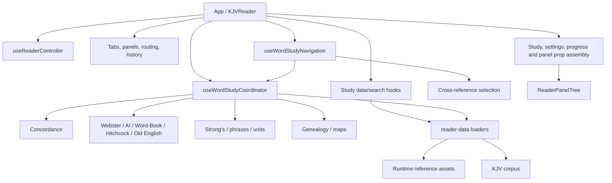

# KJVReader Refactor and Study-Mode Performance Plan

**Assessment date:** 2026-08-24
**Committed baseline:** `cb46f04` (`refactor(reader): harden corpus lifecycle`)
**Scope:** Reduce `KJVReader` orchestration risk and improve study-word responsiveness without changing product behavior.
**Status:** The first compatibility-safe extraction and performance slice is implemented but not committed. Nothing has been pushed.

## Executive result

`KJVReader` was 4,601 lines at the committed baseline. The first slice moves the asynchronous word-study fan-out into `useWordStudyCoordinator`, removes duplicated work, and reduces `KJVReader` to 4,259 lines. The new coordinator is 573 lines and owns one cohesive workflow: converting a selected Bible token into progressively available study-tool selections.

The cold-path delay was mainly CPU scheduling, not network transfer. In the initial local Chromium trace, all 13 study responses arrived in about 0.28 seconds, but the click was blocked for about 4.18 seconds and the aggregate loaders took about 5.29 seconds. Genealogy enrichment alone used about 2.30 seconds, and loading each payload caused several search tools to eagerly construct indexes that a word selection did not need.

After this slice, two fresh common-word runs produced:

| Measure | Before | Current local runs | Change |
|---|---:|---:|---:|
| Click returns to browser | ~4.18 s | ~0.40–0.69 s | Approximately 84–90% faster |
| First matching study tools selected | All tools waited for slowest loader | ~0.76–0.92 s | Progressive instead of aggregate |
| Common-word fan-out settled | ~5.29 s loader fan-out | ~1.39–2.35 s | Approximately 56–74% faster |
| Genealogy enrichment CPU | ~2.30 s | ~0.84 s isolated | Approximately 64% faster |
| Genealogy-name fan-out (`Adam`, warm corpus) | Not separately measured | ~2.16 s | Residual target for worker/build-time work |

These are development-machine diagnostics, not universal device guarantees. The browser regression suite now records the same named measures and enforces conservative ceilings.

## Graphify architecture map

Graphify was refreshed after the extraction. The current graph contains **3,159 nodes, 6,197 edges, and 195 communities**. `KJVReader()` remains the principal application god node with degree 68. The new `useWordStudyCoordinator()` node is present and connected to the study loaders, normalized reference resolvers, performance measures, and study state.

The graph confirms that extraction alone does not remove `KJVReader` centrality: the component still composes nearly every domain. The refactor therefore needs to continue by ownership slice, not by moving arbitrary line ranges.

## Study-word latency assessment

### Previous request path

1. A token click entered `useWordStudyNavigation`.
2. The navigation hook opened cross references.
3. `openWordInStudyTools` opened the same cross references a second time.
4. It requested concordance, dictionaries, Strong's, genealogy, maps, phrases, and units together.
5. Every tool selection and matching accordion waited on one `Promise.all`, so the fastest dictionaries were gated by the slowest corpus-dependent operation.
6. Concordance and genealogy scanned the full corpus on the main thread.
7. When payload states arrived, concordance, dictionaries, genealogy, maps, and Strong's eagerly built complete search indexes even though the user had selected one exact word.
8. No request generation protected final selection state, so a slower earlier click could overwrite a later click.

### Controls implemented in this slice

- Cross references have one owner per navigation path; the duplicate open/load sequence is removed.
- Cross-reference and word-study requests use monotonically increasing request identifiers, so stale asynchronous results cannot replace the latest selection.
- Matching tool selections and accordions update progressively as each payload becomes usable.
- Full text-search indexes are built only when a search term actually requires them.
- Genealogy corpus enrichment is one filtered corpus pass rather than a large all-token index followed by five additional corpus scans.
- A compact genealogy-name gate avoids full corpus enrichment for words that cannot match genealogy.
- Genealogy work starts after primary tools have had a rendering opportunity.
- Performance marks are unique and idempotent, so overlapping clicks can be measured safely.
- Chromium coverage verifies progressive study loading and visible Concordance/Webster results.

### Payload and CPU characteristics

The study fan-out covers about 18 MB of raw JSON across concordance, cross references, dictionaries, Strong's, genealogy, and maps. Module-level loader promises already prevent duplicate network fetches after the first request. The remaining performance work is therefore mainly about parsing, matching, main-thread CPU, and when React is asked to build derived indexes.

Concordance and genealogy still depend on the complete corpus for runtime enrichment. Common non-name words now avoid genealogy enrichment, but name selections still pay that cost. This is the next meaningful performance boundary.

## Current KJVReader responsibility map

Approximate current regions after the first extraction:

| Region | Approximate lines | Ownership concern |
|---|---:|---|
| Shell, startup, persistence/controller composition | 340–948 | Many lifecycle effects and installation/tour state remain in the root component |
| Study data/search hook composition | 948–1,445 | Large adapter surface; each tool exposes many individual setters |
| Panel preview, movement, split, insert and close lifecycle | 1,449–1,910 | Related invariants are spread across refs and imperative callbacks |
| Tab, reader navigation, routing and target selection | 1,930–2,533 | Broad workspace command surface with several destination policies |
| Progress and tab actions | 2,534–2,663 | Smaller, coherent extraction candidate |
| Study matching and accordion derivation | 2,695–2,996 | Pure matching logic still lives in the component |
| Study orchestration adapter call | 3,061–3,125 | Explicit boundary now exists, but the argument surface is too wide |
| Final derived props and render composition | 3,581–4,259 | Large object/prop assembly and inline callbacks obscure view boundaries |

The line count is a symptom. The more important issue is that a change to one workflow can still touch layout state, routing, tool state, derived props, and render composition in the same component.

## Phased refactor plan

### Phase 1 — word-study boundary and characterization

**Status: implemented, awaiting review/commit approval.**

- Extract `useWordStudyCoordinator`.
- Make latest-click ownership explicit.
- Apply study results progressively.
- Defer search-only indexes.
- Gate and optimize genealogy enrichment.
- Add named performance measures and a Chromium workflow test.
- Preserve the existing tool order, active target behavior, selected entry shapes, loading/error UI, and reference navigation.

Exit evidence: typecheck, lint, focused unit tests, focused Playwright test, and repeat local measurements.

### Phase 2 — pure word-study matching and indexed exact lookups

Move the remaining component-local matching functions into `src/lib/word-study-selection.ts`:

- phrase-at-token resolution;
- AI-dictionary phrase-at-token resolution;
- token resolution at a verse location;
- genealogy ranking/deduplication;
- matching accordion derivation.

Build normalized key/alias maps once per loaded payload with `WeakMap`-backed caches. This removes repeated `Object.keys`/`Object.entries` scans while retaining the current first-match and alias semantics. Characterization fixtures must cover case, plural fallback, aliases, Unicode dashes/apostrophes, phrase precedence, maps, genealogy rank, and missing results.

Expected `KJVReader` reduction: about 300 additional lines.

### Phase 3 — remove corpus-dependent enrichment from the UI thread

Choose one of these compatibility-preserving implementations after profiling representative low-end devices:

1. **Build-time enrichment (preferred):** produce versioned, already-enriched concordance and genealogy runtime assets, validate them against the canonical corpus during generation, and keep current public URLs or provide an atomic manifest migration.
2. **Dedicated study-data worker:** parse and enrich in a worker, return the existing payload contracts, support cancellation/stale generations, and avoid retaining a second full corpus in memory longer than necessary.

Build-time assets offer the lowest runtime CPU and memory cost. A worker is the safer interim choice if generator provenance or deployment compatibility prevents an asset-format migration. No S3/CDN move is required for either option.

Exit evidence: exact payload-equivalence tests, genealogy-name E2E coverage, no main-thread long task over the agreed budget, and unchanged runtime URL/manifest behavior.

### Phase 4 — panel interaction controller

Extract the roughly 460-line preview/move/add/orientation/split/close region into `usePanelInteractionController`.

The hook should own:

- preview refs and cleanup;
- neighbor lookup/cache invalidation;
- move/add/orientation preview state;
- split/group insertion commands;
- leaf close/move invariants.

Do not change the panel-tree data model or drag/menu semantics in this phase. Add reducer/pure-command tests before changing any representation.

Expected `KJVReader` reduction: 400–500 lines.

### Phase 5 — workspace navigation controller

Extract tab opening, targeted-panel routing, chapter/reference navigation, scroll targeting, and destination-policy handling into a workspace controller façade. Preserve every current destination (`new-tab`, `new-panel`, `targeted-panel`, and sidebar behavior) and URL hash format.

Expected `KJVReader` reduction: 500–650 lines.

### Phase 6 — view-model and render boundaries

Replace the large final prop-assembly region with stable domain view models:

- `useStudyToolsViewModel`;
- `useSettingsViewModel`;
- `useProgressViewModel`;
- a memoized workspace/panel composition boundary.

Avoid cosmetic memoization of unstable inline objects. Establish stable callbacks and dependency-minimal memoization only where profiling shows meaningful rerender reduction.

Expected `KJVReader` reduction: 500–700 lines.

### Phase 7 — shell lifecycle cleanup

Move PWA installation, guided tour, completion celebration, and remaining startup-only effects into focused hooks/components. Keep `KJVReader` as the composition root that selects controller state and renders the shell.

Long-term target: approximately 2,000–2,500 lines for the composition root, with no domain algorithm, parser, persistence policy, or multi-tool async workflow implemented inline.

## Compatibility contract

Every phase must preserve:

- Bible text, token metadata, Strong's links, and selected-word highlighting;
- the current study-tool list, ordering, matching rules, and displayed entries;
- cross-reference, note-link, map, genealogy, and concordance navigation;
- sidebar/tab/panel destination settings;
- tab, split, targeted-panel, fullscreen, and history behavior;
- storage keys, persisted shapes, layout hashes, public asset URLs, service-worker ownership, and offline packages;
- current loading, error, empty-result, and search behavior;
- keyboard and pointer interaction semantics.

No phase should combine extraction with a state-model rewrite. First move behavior behind a tested boundary; simplify the internals in a later independently reviewable change.

## Verification gates for each phase

1. `npm run typecheck`
2. `npm run lint`
3. Focused unit/characterization tests for the extracted domain
4. `npm test`
5. Focused Playwright journeys, followed by the full suite for a commit candidate
6. `npm run build` and distribution checks for a release candidate
7. `git diff --check`
8. Graphify refresh and centrality/path review
9. Manual study smoke test for a common word, a Strong's token, a phrase, a place, and a genealogy name

Commits and pushes remain approval-gated. Related phases should be batched into deliberate commits, and pushes should be held until a useful Amplify rebuild checkpoint is ready.

## Immediate next recommendation

Review and commit Phase 1 as one cohesive change after the full unit and browser suites pass. Then implement Phase 2 before attempting panel or workspace extraction. It is the lowest-risk way to reduce another component-local algorithm block while making later study-worker/build-time work easier to test.
