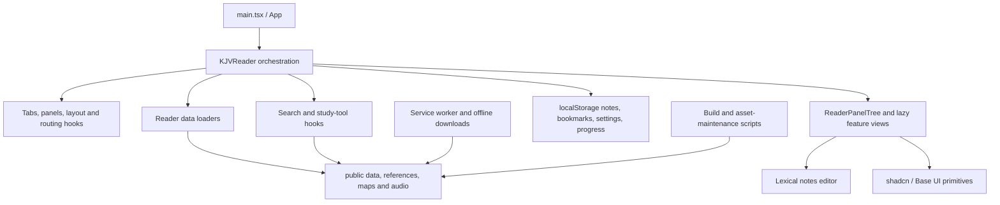

# KJV Only Project Assessment

**Assessment date:** 2026-08-23  
**Repository revision:** `25c01411c5d7b9c312ae4c9b96a7d50720e0c0a4`  
**Goal:** Harden and improve the current product without changing its existing user-facing functionality.

## Executive assessment

The application has a sound functional base. It is a privacy-friendly, client-only React 19/Vite PWA; TypeScript is strict; the current lint, unit-test, and production-build baselines pass; major secondary views are already lazy-loaded; data loaders generally cache their promises; and Graphify found no import cycles. The code also shows real progress toward separating pure domain logic and hooks from presentation.

The project is not yet structurally or operationally hardened. The highest-value work is concentrated in five areas:

1. **Deployment hygiene:** Vite copies the entire 1.4 GB `public/` tree, including the ignored 190 MB `public/delete/` quarantine. The measured `dist/` is therefore 1.4 GB and contains obsolete source databases, backups, and intermediate corpora.
2. **Reader orchestration:** `KJVReader` is 4,805 lines, has about 65 graph connections, and still owns initialization, persistence, data loading, routing, search, layout, dialogs, and cross-feature coordination. It is the main change-risk and performance bottleneck.
3. **Startup cost:** `/data/kjv.json` is 73.6 MB raw (about 5.6 MB gzip). A local Node measurement took about 756 ms merely to parse it and left about 108 MB of heap in use before React rendered or search indexes were built. The browser then builds a full verse index synchronously.
4. **Trust-boundary hardening:** The security review validated seven issues—three medium and four low—around imported editor links, the map-photo downloader, recursive share links, unbounded imports, and imported timestamps. No critical or high application-runtime vulnerability was validated.
5. **Delivery controls:** There is no repository CI workflow, security policy, browser/E2E suite, coverage gate, bundle/data budget, explicit deploy manifest, or checked-in production-header configuration. ESLint excludes the editor, scripts, and service worker, which include several security-sensitive paths.

### Overall posture

| Area | Current posture | Principal reason |
|---|---|---|
| Functional correctness | Good baseline | 139 tests pass; lint and production build pass |
| Security | Moderate | Small server-side attack surface, but seven validated client/tooling findings and 18 dependency advisories |
| Architecture | Moderate | Acyclic graph and useful pure modules, but reader orchestration remains highly centralized |
| Performance | Needs focused work | Very large startup corpus, synchronous indexing, 1.135 MB minified entry chunk, 1.4 GB deploy output |
| Design system | Moderate-good | shadcn/Base UI foundation is coherent; composition and token usage have drifted |
| Testing | Good unit foundation, incomplete system coverage | Pure logic is tested; browser, accessibility, PWA, and end-to-end workflows are not |
| Operations/release | Weak | No CI, deploy allowlist, security policy, or performance budgets in the repository |

## Scope and method

This assessment used:

- Graphify static mapping of `src/`.
- A Codex Security Standard scan with three independent discovery passes followed by source-to-sink validation and severity calibration.
- Direct review of application code, scripts, configuration, PWA behavior, data boundaries, repository composition, and prior reports.
- `npx shadcn info` plus the applicable Base UI/shadcn composition and styling rules.
- Successful current-state execution of `npm run lint`, `npm test -- --reporter=verbose`, and `npm run build`.
- `npm audit --json` and `npm audit --omit=dev --json` against the current lockfile.
- Build-output, asset-size, source-size, and Bible JSON parse/memory measurements.

The Graphify root scan detected 3,319 supported files, but most were bulk images/audio rather than source. The structural graph was therefore built over all 206 supported files in `src/`; scripts, service-worker code, configuration, and public-data boundaries were reviewed directly. Binary media and bulk reference records were not inspected one by one.

The security scan was completed under scan ID `35374de9-4b6b-4144-8fce-c2d566f32010`. Trusted Access for Cyber status was advisory `not_granted`; the scan still completed, but no gated TAC capability was available. Production hosting headers could not be assessed because hosting configuration is not present in the repository.

## Architecture map



### Graphify results

The generated graph contains **1,184 nodes**, **3,725 edges**, and **48 communities**. It found **no import cycles**, which is an important structural strength. It also found 208 isolated or weakly connected nodes; many are configuration objects, types, or AST elements rather than necessarily defective modules.

The most central nodes were:

| Node | Graph connections | Interpretation |
|---|---:|---|
| `cn()` | 230 | Expected styling utility hub; high centrality is not itself a design problem |
| `KJVReader()` | 65 | True domain/orchestration god node and the primary refactor target |
| `Button()` | 40 | Expected shared primitive |
| `useToolbarContext()` | 39 | Editor subsystem hub; keep its boundary explicit |
| `Book` | 38 | Shared domain type crossing many features; useful, but indicates wide reader-domain coupling |
| `normalizeConcordanceWord()` | 29 | Cross-feature reference normalization hub; a candidate for a documented domain service |

Graphify identified low-cohesion communities around reference/study hooks, the editor toolbar, search/verse rendering, dialogs/settings, and reader orchestration. Its 15 inferred edges should be treated as hypotheses rather than proof; for example, inferred `KJVReader` links were checked against source before being used in this assessment.

Generated artifacts:

- `graphify-out/graph.html` — interactive architecture graph.
- `graphify-out/GRAPH_REPORT.md` — Graphify audit report.
- `graphify-out/graph.json` — raw graph data.

Graphify 0.9.36 warned that the installed skill instructions were from 0.8.32. The graph built successfully, but this version mismatch is a methodology caveat.

## Structural assessment

### What is working well

- The module graph is acyclic.
- `src/lib/` contains meaningful pure logic for references, layouts, searches, transfers, bookmarks, genealogy, and scroll targets.
- Feature-specific hooks have already extracted concordance, dictionary, genealogy, maps, topics, routing, bookmarks, notes, tabs, highlights, and sidebar state.
- Secondary views such as Notes, Search, map geometry, genealogy dialogs, and study sidebars are split into lazy chunks.
- Shared Bible and reader types provide consistent vocabulary across features.
- TypeScript enables `strict`, unused checks, fallthrough checks, and unchecked side-effect import checks (`tsconfig.app.json:18-23`).

### Main structural problem: orchestration concentration

The current largest TypeScript/TSX files are:

| File | Lines | Structural concern |
|---|---:|---|
| `src/components/reader/kjv-reader.tsx` | 4,805 | Application controller, persistence coordinator, loader, router, and view composer in one component |
| `src/components/reader/reader-panel-tree.tsx` | 1,999 | Recursive layout rendering plus many view-specific branches and callbacks |
| `src/components/editor/editor-ui/color-picker.tsx` | 1,928 | Large imported editor subsystem with its own UI conventions |
| `src/components/reader/search-page.tsx` | 1,506 | Search state, controls, results, and rendering are tightly combined |
| `src/lib/search.ts` | 899 | Large but mostly domain-oriented; suitable for worker extraction |

`KJVReader` remains responsible for too many lifecycle domains:

- startup data loading and the first usable screen (`kjv-reader.tsx:826-870`);
- URL layout parsing and application;
- tabs, panels, active targets, and history;
- localStorage hydration and writes;
- search-index construction (`kjv-reader.tsx:1233`);
- notes, bookmarks, highlights, progress, settings, dialogs, and study tools;
- composing the large callback/prop surface passed down to panel rendering.

This makes otherwise local changes risky because invariants are spread across hooks, component state, effects, and callbacks. The issue is not simply file length; it is ownership ambiguity.

### Recommended target structure

Preserve every current view and interaction, but introduce explicit ownership:

```text
src/
  app/                 bootstrap, themes, service-worker registration
  reader/
    controller/        useReaderController, commands/events, selectors
    workspace/         tabs, panel tree, layout hash, leaf history
    reading/           book/chapter navigation, highlights, progress
    notes/             notes domain, editor adapter, import/export
    search/            search domain and worker adapter
    study/             reference-data tools and dialogs
    persistence/       schemas, migrations, storage adapter
  data/                typed loaders, manifests, validation
  components/ui/       shadcn/Base UI primitives
  lib/                 genuinely cross-domain pure utilities
```

The first step should be a `useReaderController` façade with a reducer or explicit commands, not a wholesale rewrite. Move one invariant-owning slice at a time behind characterization tests. `KJVReader` should ultimately select state, dispatch commands, and compose views; it should not implement every workflow.

### State and persistence

Persistence is currently distributed among multiple hooks/effects and several versioned localStorage keys. Some hydration paths catch malformed JSON, but policies are inconsistent; for example, the read-progress write at `kjv-reader.tsx:819-824` has no quota/error handling.

Introduce a single persistence boundary with:

- versioned runtime schemas for every stored record;
- migrations with explicit old/new fixtures;
- finite/string-length/array/depth budgets reused by imports and rehydration;
- atomic state replacement only after complete validation;
- consistent quota and serialization failure handling;
- a user-visible recovery path that does not require manually clearing all site data.

## Security assessment

### Threat model

This is a static, client-only application. There is no application server, authentication, session, or multi-tenant authorization boundary in the reviewed repository. That removes many common classes of remote vulnerability. The meaningful trust boundaries are instead:

- imported notes/bookmarks JSON into editor and persisted state;
- shared URL fragments into recursive workspace layouts;
- same-origin reference corpora into rendering/search;
- localStorage into application state;
- service-worker responses into CacheStorage;
- map metadata into developer-side network requests and filesystem writes.

### Validated findings

| ID | Severity | Finding | Evidence and impact |
|---|---|---|---|
| SEC-01 | Medium | Imported Lexical links bypass URL sanitization | Imported `note.body` is only type-checked (`reader-transfer.ts:69-78`), materialized as an editor state (`notes-page.tsx:97-105`), and the modifier-click path calls raw `window.open(linkNode.getURL(), "_blank")` (`floating-link-editor-plugin.tsx:361-370`). A crafted backup plus Ctrl/Cmd-click can cause unsafe navigation in browser-dependent conditions. |
| SEC-02 | Medium | Map-photo output path traversal | Metadata `thumbnail.file` values are joined directly to `outputDir` (`fetch-map-photos.mjs:235-238`) and written (`:261-265`) without canonical containment or symlink protection. Current metadata is safe and the command is manual, which lowers likelihood. |
| SEC-03 | Medium | Map-photo downloader SSRF | `file_url`/`thumbnail_url_pattern` reaches `fetch` (`fetch-map-photos.mjs:126-130,166-176`) without scheme, host, redirect, or resolved-address policy. Current URLs are HTTPS `upload.wikimedia.org`; risk rises materially if the script moves into CI. |
| SEC-04 | Low | Map-photo response/batch exhaustion | The downloader buffers each whole response with `arrayBuffer()` and has no timeout, byte cap, stream bound, or default batch limit (`fetch-map-photos.mjs:166-176,186-191`). |
| SEC-05 | Low | Layout-hash recursion and cardinality are unbounded | The URL-controlled parser recursively constructs panel trees (`layout-hash.ts:207-253`) and maps unlimited tabs/ranges (`:51-77,295-355`), allowing a shared link to freeze or crash the local tab. |
| SEC-06 | Low | Notes/bookmarks imports lack resource budgets | Both import paths call `file.text()` before a size check (`use-panel-transfer.ts:55-62,93-100`), then synchronously parse and traverse every entry (`reader-transfer.ts:228-303`). |
| SEC-07 | Low | Imported timestamps can crash Notes | `createdAt`/`updatedAt` require only `typeof === "number"` (`reader-transfer.ts:69-78`). Out-of-range values reach `Intl.DateTimeFormat` (`notes-page.tsx:112-116`) and can persistently break that view. |

### Required remediations

1. Apply one URL protocol policy to link creation, import, rendering, and navigation. Sanitize again at `window.open`, reject unsafe imported LinkNodes, and use `noopener,noreferrer` semantics. Test scheme casing, control characters, malformed URLs, and the allowed `kjv:` path.
2. For map outputs, accept only a documented basename grammar, resolve against a canonical root, verify containment, resist symlink redirection, write to a fresh staging file, and atomically rename.
3. For map network access, require HTTPS and exact permitted origins, revalidate redirects, reject credentials/unexpected ports, block loopback/private/link-local/metadata-service addresses, and restrict CI egress.
4. Add downloader timeouts, redirect limits, byte limits, content/image validation, streaming temporary files, batch/total-byte quotas, and partial-file cleanup.
5. Give layout hashes explicit byte, tab, node, depth, title, digit, and range budgets. Prefer an iterative/depth-aware parser and apply the layout only after complete validation.
6. Give imports explicit file, entry, string, editor-node/depth, range, and aggregate-storage limits. Validate larger documents in a cancellable worker.
7. Require finite safe-integer timestamps within the JavaScript Date range and a reasonable application window. Revalidate localStorage data and make formatting fall back safely.

### Defense-in-depth items not validated as current vulnerabilities

- `websters-tool.tsx` uses `dangerouslySetInnerHTML` through `renderWebsterDefinitionHtml` (`reader-data.ts:250-259`). The bundled Webster data currently contains only expected line-break markup and no attacker-controlled source was established, so this is not a validated current exploit path. Remove the sink anyway: split on the allowed line-break representation and render React text/`<br />`, or use a narrow sanitizer.
- Regex search can perform expensive main-thread work on a user-supplied pattern. It has no realistic remote attacker path today, but a worker, cancellation, pattern-length limit, and safe-regex strategy would improve robustness.
- `public/sw.js` deletes every CacheStorage entry except its own current key (`sw.js:54-65`), and development registration deletes all service workers/caches for the origin (`register-sw.ts:8-17`). This is an origin-isolation issue if the app is ever co-hosted. Restrict cleanup to the app prefix and registration scope.
- The service worker uses `kjv-only-cache-v4`, while the offline helper falls back to `kjv-only-cache-v3` (`offline-downloads.ts:1-3`). Centralize a generated cache/version manifest so an update cannot strand or delete expected offline packages.
- No production header configuration was available. Verify a deployment-level CSP, HSTS, Referrer-Policy, Permissions-Policy, COOP/CORP as appropriate, and correct immutable/data cache headers.

### Dependency and supply-chain posture

The current `npm audit` reported **18 advisories: 1 critical, 12 high, 2 moderate, and 3 low**. The direct critical advisory is against installed Vitest 4.0.18; the direct Vite 7.3.1 toolchain also appears in high/moderate development-server advisories. The production-omitted audit still reported five toolchain/transitive advisories (Vite/esbuild/nanoid/picomatch/postcss); this does not prove that vulnerable code executes in the browser bundle, but it does affect developer/build exposure.

Actions:

- Update Vitest and Vite to patched supported releases, review their release notes, run the full regression suite/build, then rerun both audits.
- Do not expose Vite, Vitest UI, or preview servers to untrusted networks; bind development services to loopback by default.
- Add lockfile dependency review, a generated SBOM, and periodic automated updates.
- Distinguish build-only advisories from shipped-browser reachability in triage rather than treating every audit row as a production exploit.
- Add `SECURITY.md` with supported versions, reporting instructions, threat-model assumptions, and explicit scope for client data, share links, service-worker caches, and maintenance scripts.

## Performance assessment

### Measured baseline

These figures describe one local run and should be recorded in CI as regression baselines, not treated as universal device timings.

| Measure | Current result | Assessment |
|---|---:|---|
| Production build | Passed; approximately 3m21s reported by Vite / 237s wall time | Static asset copying dominates enough to warrant measurement and manifesting |
| `dist/` | 1.4 GB, 9,723 files | Excessive and contaminated by quarantine/intermediate assets |
| Main JS entry | 1,135,031 bytes minified; about 336.9 KB gzip | Above Vite's 500 KB minified warning; secondary chunks help but core remains broad |
| Notes chunk | 266.4 KB minified; about 84.0 KB gzip | Appropriate lazy boundary, but editor payload is still substantial |
| Map geometry chunk | 153.7 KB minified; about 44.8 KB gzip | Appropriate lazy boundary |
| Main CSS | 183.6 KB minified; about 33.5 KB gzip | Review utility/style duplication while preserving tokens |
| `public/data/kjv.json` | 73,576,521 bytes raw; about 5,585,264 bytes gzip | Transfer is manageable on good networks; parse/object memory is not |
| KJV JSON local parse | ~756 ms; ~108 MB heap used after parse | Likely a dominant startup/low-memory-device cost |
| Git pack | ~1,011.9 MiB | Large binary history makes clones and maintenance expensive |

The runtime data tree is approximately:

- `public/audio/`: 736 MB
- `public/maps/`: 320 MB
- `public/delete/`: 190 MB
- `public/data/`: 97 MB
- `public/references/`: 18 MB

The largest built file is `dist/delete/public/data/kjv.sqlite` at about 99 MB—an ignored quarantine artifact that should never have entered the deploy output. Other copied quarantine files include full concordance/Strong's/genealogy intermediates and backups.

### Startup and search path

`KJVReader` waits for `loadKjvBooks()` before applying the layout and declaring the reader loaded (`kjv-reader.tsx:826-861`). It then synchronously derives a complete verse search index with `useMemo(() => buildVerseSearchIndex(books), [books])` (`:1233`). Compression reduces network transfer but not JSON decode, object allocation, garbage collection, or index construction.

Recommended sequence:

1. **Measure in a browser first:** collect navigation timing, LCP, INP, long tasks, heap, KJV fetch/decode, index-build time, and interaction latency on a representative low/mid mobile device.
2. **Split the corpus without changing reader behavior:** load the initial book/chapter needed for the first screen, then hydrate remaining books in the background or from IndexedDB. Keep references and canonical verse addressing stable.
3. **Move expensive search work off the main thread:** precompute compact normalized search records at build time or build/query them in a Web Worker with cancellation and progress.
4. **Create real route/feature boundaries:** dynamically import editor infrastructure and study-tool domains only when opened. Avoid relying only on manual Rollup chunk names; reduce the imports reachable from the reader controller.
5. **Use stable asset manifests:** version core reader data, optional references, maps, and audio as separate downloadable packages. This aligns service-worker upgrades with the user-visible offline manager.

### Deployment and asset pipeline

Vite's default `public/` behavior is the wrong boundary for this repository because that tree mixes runtime assets, build inputs, optional packages, and quarantined files.

Create an explicit deployment pipeline:

- Move raw OSIS, SQLite, source JSONL/KML, backups, and `public/delete/` outside the deployable public root.
- Generate/copy only an allowlisted runtime manifest into the build.
- Fail CI if a forbidden path appears in `dist/`, an undeclared asset is copied, a required asset is missing, or a core/optional-package budget regresses unexpectedly.
- Preserve current public URLs through manifest mappings or a CDN prefix, so this cleanup does not alter behavior.
- Consider Git LFS, object storage, or release/CDN artifacts for audio/maps and generated corpora. Keep integrity hashes and reproducible generation metadata in Git.
- Separate the small core shell from optional offline audio/maps/reference packages; do not force the core deploy/update path to behave like a monolithic 1.4 GB artifact.

## Design-system and UX implementation assessment

The project is configured for shadcn `base-nova`, Base UI, Tailwind CSS v4, CSS variables, and Lucide icons (`components.json`). This is a good foundation. Dialog-title heuristics did not find an obvious missing-title case, and shared primitives are broadly reused.

The shadcn review did identify consistency debt:

- 96 `space-x-*`/`space-y-*` usages where container `gap-*` is usually more robust.
- 16 repeated equal width/height pairs that should generally use `size-*`.
- 16 manual dark-mode color patterns and 45 raw status-color patterns that should be checked against semantic tokens.
- Only five `data-icon` uses despite many sized icons inside shared buttons.
- Direct Select/Dropdown items without grouping wrappers were flagged in settings, reader-panel, and editor toolbar files. This is a heuristic, so verify each composition against the current Base UI wrapper before editing.

Recommended design hardening:

- Normalize spacing, icon sizing, and status colors through shared variants/tokens rather than feature-local utility strings.
- Audit Base UI composition: group Select/Dropdown items, preserve accessible names/descriptions, and use the established Field/FieldGroup patterns for form layouts.
- Add automated axe checks and keyboard/focus E2E coverage for dialogs, command palette, sidebar, panel splits, editor toolbar, search results, and offline dialogs.
- Test narrow/mobile layouts, zoom to 200%, high contrast, reduced motion, and long translated-like labels even if the product remains English-only.
- Treat the large color picker/editor subtree as a vendored-style subsystem: document deviations, keep it behind an adapter, and lint/test its security-relevant link behavior.

## Testing, linting, and release engineering

### Current strengths

- All 26 Vitest files and 139 tests passed in about 6.2 seconds.
- Coverage includes layouts, routing, history, scroll targets, imports, references, search, maps, genealogy, service-worker cache helpers, and study-state logic.
- The production TypeScript/Vite build and ESLint baseline pass.

### Gaps

- Vitest uses a Node-oriented unit setup; there is no real-browser component or end-to-end suite.
- There is no coverage configuration or minimum threshold.
- No checked-in GitHub Actions or equivalent CI workflow was found.
- ESLint only targets `src/**/*.{ts,tsx}` and explicitly excludes `src/components/editor/**`; `scripts/**` and `public/sw.js` are also outside its configured files (`eslint.config.mjs:9-22`).
- Production wraps the app in `StrictMode`, but development deliberately does not (`main.tsx:13-15`). This removes useful development-time effect/lifecycle diagnostics unless there is a documented compatibility reason.

### Recommended verification pyramid

1. **Unit/property tests:** parser budgets, malformed storage/imports, recursive layouts, reference parsing, search equivalence, and all migrations.
2. **Browser component tests:** editor links, notes recovery, keyboard/focus behavior, localStorage quota errors, ResizeObserver/panel behavior.
3. **Playwright E2E:** first load, chapter navigation, search modes, notes/bookmarks import/export, share-layout round trips, offline package download, service-worker upgrade, and recovery from corrupt persisted state.
4. **Accessibility:** axe plus manual keyboard/reader landmarks and focus-return checks.
5. **Performance gates:** core entry/chunk sizes, KJV decode/index timings, long-task limits, required/forbidden deploy assets, and total package manifests.
6. **Supply chain:** lint, typecheck, tests, build, audit, license/SBOM generation, and artifact integrity in CI.

Expand ESLint with environment-specific configurations for browser TS/TSX, editor TS/TSX, Node scripts, and service-worker JS. Do not enable a large new rule set and mass-reformat in one change; establish a warning baseline, fix security/correctness rules first, then ratchet.

## Documentation and operational ownership

The README explains the product and local commands, but the repository needs maintainers' documentation for:

- architecture and state ownership;
- runtime versus source/generated/quarantined assets;
- reproducible data-generation inputs and expected hashes/counts;
- service-worker cache/version and offline-package lifecycle;
- localStorage schemas and migrations;
- security reporting and threat-model assumptions;
- deployment headers, cache-control rules, rollback, and smoke tests;
- a decision log for intentional browser/editor/shadcn deviations.

The existing `TODO` and historical reports contain useful ideas, but they are not a release-quality tracking system. Convert accepted work into small, testable issues with owner, evidence, compatibility constraints, and completion criteria.

## Prioritized hardening roadmap

### Priority 0 — prevent avoidable security and deployment failures

1. Stop deploying `public/delete/` and other undeclared intermediates; add a `dist/` allowlist/forbidden-path CI check.
2. Fix SEC-01 through SEC-07 with focused regression tests.
3. Patch Vitest/Vite and triage remaining lockfile advisories by runtime reachability.
4. Namespace service-worker cleanup and centralize the cache/offline manifest version.
5. Add `SECURITY.md` and a minimal CI pipeline for lint, typecheck, tests, build, audit, and artifact checks.

**Completion evidence:** clean build contains only declared runtime assets; seven security regressions have tests; audit is rerun and exceptions are documented; cache upgrade E2E passes; CI is required on the main branch.

### Priority 1 — create stable ownership boundaries

1. Add characterization tests for current tabs, panels, history, URL layouts, highlights, notes, and startup behavior.
2. Introduce `useReaderController` plus explicit commands/selectors.
3. Move persistence schemas/migrations behind one adapter.
4. Extract workspace/layout, reading/progress, notes, search, and study orchestration one slice at a time.
5. Reduce `ReaderPanelTree` to recursive layout composition with feature adapters rather than a feature switchboard.

**Completion evidence:** existing fixtures and E2E behavior are unchanged; `KJVReader` no longer owns feature algorithms or direct storage writes; each domain exposes a documented public API.

### Priority 2 — remove main-thread and delivery bottlenecks

1. Instrument real-browser startup/search/memory baselines.
2. Shard/version KJV and optional reference assets while preserving canonical URLs through a manifest/adapter.
3. Move index construction and regex/fuzzy search to a cancellable worker or precomputed index.
4. Lazy-load editor/study domains at actual interaction boundaries.
5. Separate core, references, maps, and audio packages; move heavy binaries out of ordinary Git history/deployment where practical.

**Completion evidence:** first usable chapter no longer waits for full-corpus parsing/indexing; long search does not block input; core asset/chunk budgets pass; optional offline packages remain behaviorally identical.

### Priority 3 — consistency and maintainability

1. Normalize shadcn/Base UI composition, spacing, icon, and semantic color conventions.
2. Expand lint and browser/accessibility coverage.
3. Add architecture, data pipeline, cache lifecycle, release, and recovery documentation.
4. Ratchet test coverage and dependency/update automation.

## Safe implementation strategy

To honor the no-functionality-change goal:

1. Record current behavior with fixtures for imports, storage, layout hashes, search outputs, and generated data counts/hashes.
2. Add browser journeys for the critical user workflows before moving ownership.
3. Make one boundary change at a time; keep adapters compatible with current props and stored formats.
4. Compare output/state snapshots and performance traces on each step.
5. Use migrations and dual-read/single-write transitions for stored data; never silently discard a user's notes, bookmarks, highlights, or offline choices.
6. Ship service-worker/data-manifest changes with an explicit upgrade/rollback test because cache bugs can outlive the JavaScript release that introduced them.

## Final judgment

This is a capable application with substantial feature depth and a better-than-average unit-tested pure-logic layer. Its principal problem is not broken functionality; it is that the current deployment boundary, startup data model, and reader ownership model have outgrown the structure around them. Addressing the Priority 0 items first will remove the clearest security and release risks. The controller/persistence boundaries and data/worker changes should then deliver the largest long-term gains in structural soundness and perceived performance without redesigning the product.

No product functionality was changed as part of this assessment.
